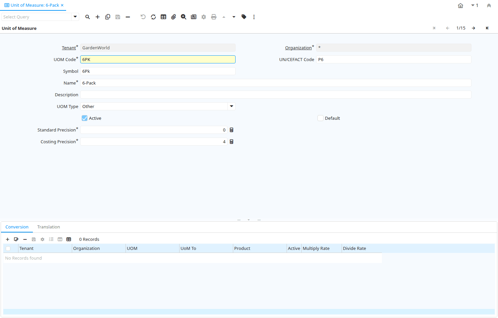

# Unit of Measure

Window ID 120

*11/06/1999 → 02/01/2000*

**Description:** Maintain Unit of Measure 

**Comment/Help:** The Unit of Measure Window is used to define non monetary units of measure.  It also defines if conversion between units of measure are allowed and how they are to be performed. The system provides some automatic conversions between units of measures (e.g. minute, hour, day, working day, etc.) if they are not explicitly defined here.
Conversions need to be direct (i.e. if you have only a conversion between A-B and B-C, the system cannot convert A-C, you need to define it explicitly).

## Tab: Unit of Measure

*Tab Level 0 · Created 11/06/1999 · Updated 02/01/2000*

**Description:** Define units of measure

**Comment/Help:** The Unit of Measure Tab defines a non monetary Unit of Measure.

| **Name** | **Description** | **Comment/Help** | **Technical Data** |
|---|---|---|---|
| Tenant | Tenant for this installation. | A Tenant is a company or a legal entity. You cannot share data between Tenants. | C_UOM.AD_Client_ID<small> numeric(10)   Table Direct</small> |
| Organization | Organizational entity within tenant | An organization is a unit of your tenant or legal entity - examples are store, department. You can share data between organizations. | C_UOM.AD_Org_ID<small> numeric(10)   Table Direct</small> |
| UOM Code | UOM EDI X12 Code | The Unit of Measure Code indicates the EDI X12 Code Data Element 355 (Unit or Basis for Measurement) | C_UOM.X12DE355<small> character varying(4)   String</small> |
| UN/CEFACT Code | Code for Units of Measure used in International Trade | As defined at United Nations Centre for Trade Facilitation and Electronic Business.  https://service.unece.org/trade/uncefact/vocabulary/rec20/ | C_UOM.UNCEFACT<small> character varying(10)   String</small> |
| Symbol | Symbol for a Unit of Measure | The Symbol identifies the Symbol to be displayed and printed for a Unit of Measure | C_UOM.UOMSymbol<small> character varying(10)   String</small> |
| Name | Alphanumeric identifier of the entity | The name of an entity (record) is used as an default search option in addition to the search key. The name is up to 60 characters in length. | C_UOM.Name<small> character varying(60)   String</small> |
| Description | Optional short description of the record | A description is limited to 255 characters. | C_UOM.Description<small> character varying(255)   String</small> |
| UOM Type |  |  | C_UOM.UOMType<small> character varying(2)   List</small> |
| Active | The record is active in the system | There are two methods of making records unavailable in the system: One is to delete the record, the other is to de-activate the record. A de-activated record is not available for selection, but available for reports. There are two reasons for de-activating and not deleting records: (1) The system requires the record for audit purposes. (2) The record is referenced by other records. E.g., you cannot delete a Business Partner, if there are invoices for this partner record existing. You de-activate the Business Partner and prevent that this record is used for future entries. | C_UOM.IsActive<small> character(1)   Yes-No</small> |
| Default | Default value | The Default Checkbox indicates if this record will be used as a default value. | C_UOM.IsDefault<small> character(1)   Yes-No</small> |
| Standard Precision | Rule for rounding  calculated amounts | The Standard Precision defines the number of decimal places that amounts will be rounded to for accounting transactions and documents. | C_UOM.StdPrecision<small> numeric(10)   Integer</small> |
| Costing Precision | Rounding used costing calculations | The Costing Precision defines the number of decimal places that amounts will be rounded to when performing costing calculations. | C_UOM.CostingPrecision<small> numeric(10)   Integer</small> |

## Tab: › Conversion

*Tab Level 1 · Created 11/06/1999 · Updated 16/11/2012*

**Description:** Define standard Unit of Measure Conversion

**Comment/Help:** The Conversion Tab defines the rates for converting a Unit of Measure. The system provides some automatic conversions between units of measures (e.g. minute, hour, day, working day, etc.) if they are not explicitly defined here.
Conversions need to be direct (i.e. if you have only a conversion between A-B and B-C, the system cannot convert A-C, you need to define it explicitly).

| **Name** | **Description** | **Comment/Help** | **Technical Data** |
|---|---|---|---|
| Tenant | Tenant for this installation. | A Tenant is a company or a legal entity. You cannot share data between Tenants. | C_UOM_Conversion.AD_Client_ID<small> numeric(10)   Table Direct</small> |
| Organization | Organizational entity within tenant | An organization is a unit of your tenant or legal entity - examples are store, department. You can share data between organizations. | C_UOM_Conversion.AD_Org_ID<small> numeric(10)   Table Direct</small> |
| UOM | Unit of Measure | The UOM defines a unique non monetary Unit of Measure | C_UOM_Conversion.C_UOM_ID<small> numeric(10)   Table Direct</small> |
| UoM To | Target or destination Unit of Measure | The UOM To indicates the destination UOM for a UOM Conversion pair. | C_UOM_Conversion.C_UOM_To_ID<small> numeric(10)   Table</small> |
| Product | Product, Service, Item | Identifies an item which is either purchased or sold in this organization. | C_UOM_Conversion.M_Product_ID<small> numeric(10)   Search</small> |
| Active | The record is active in the system | There are two methods of making records unavailable in the system: One is to delete the record, the other is to de-activate the record. A de-activated record is not available for selection, but available for reports. There are two reasons for de-activating and not deleting records: (1) The system requires the record for audit purposes. (2) The record is referenced by other records. E.g., you cannot delete a Business Partner, if there are invoices for this partner record existing. You de-activate the Business Partner and prevent that this record is used for future entries. | C_UOM_Conversion.IsActive<small> character(1)   Yes-No</small> |
| Multiply Rate | Rate to multiple the source by to calculate the target. | To convert Source number to Target number, the Source is multiplied by the multiply rate.  If the Multiply Rate is entered, then the Divide Rate will be automatically calculated. | C_UOM_Conversion.MultiplyRate<small> numeric   Number</small> |
| Divide Rate | To convert Source number to Target number, the Source is divided | To convert Source number to Target number, the Source is divided by the divide rate.  If you enter a Divide Rate, the Multiply Rate will be automatically calculated. | C_UOM_Conversion.DivideRate<small> numeric   Number</small> |

## Tab: › Translation

*Tab Level 1 · Created 25/01/2000 · Updated 27/10/2024*

**Description:** Unit of Measure Translation

| **Name** | **Description** | **Comment/Help** | **Technical Data** |
|---|---|---|---|
| Tenant | Tenant for this installation. | A Tenant is a company or a legal entity. You cannot share data between Tenants. | C_UOM_Trl.AD_Client_ID<small> numeric(10)   Table Direct</small> |
| Organization | Organizational entity within tenant | An organization is a unit of your tenant or legal entity - examples are store, department. You can share data between organizations. | C_UOM_Trl.AD_Org_ID<small> numeric(10)   Table Direct</small> |
| UOM | Unit of Measure | The UOM defines a unique non monetary Unit of Measure | C_UOM_Trl.C_UOM_ID<small> numeric(10)   Table Direct</small> |
| Language | Language for this entity | The Language identifies the language to use for display and formatting | C_UOM_Trl.AD_Language<small> character varying(6)   Table</small> |
| Active | The record is active in the system | There are two methods of making records unavailable in the system: One is to delete the record, the other is to de-activate the record. A de-activated record is not available for selection, but available for reports. There are two reasons for de-activating and not deleting records: (1) The system requires the record for audit purposes. (2) The record is referenced by other records. E.g., you cannot delete a Business Partner, if there are invoices for this partner record existing. You de-activate the Business Partner and prevent that this record is used for future entries. | C_UOM_Trl.IsActive<small> character(1)   Yes-No</small> |
| Translated | This column is translated | The Translated checkbox indicates if this column is translated. | C_UOM_Trl.IsTranslated<small> character(1)   Yes-No</small> |
| Symbol | Symbol for a Unit of Measure | The Symbol identifies the Symbol to be displayed and printed for a Unit of Measure | C_UOM_Trl.UOMSymbol<small> character varying(10)   String</small> |
| Name | Alphanumeric identifier of the entity | The name of an entity (record) is used as an default search option in addition to the search key. The name is up to 60 characters in length. | C_UOM_Trl.Name<small> character varying(60)   String</small> |
| Description | Optional short description of the record | A description is limited to 255 characters. | C_UOM_Trl.Description<small> character varying(255)   String</small> |

