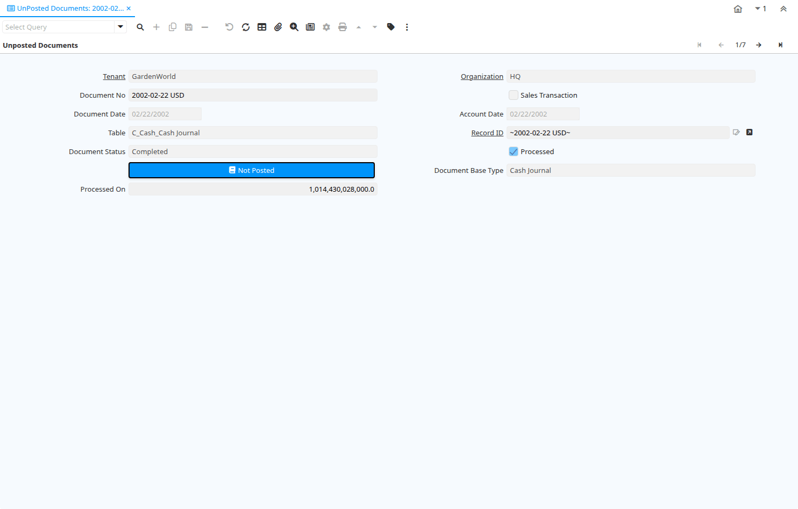

# UnPosted Documents

Window ID 294

*14/12/2003 → 02/01/2000*

**Description:** Unposted Documents

**Comment/Help:** View unposted documents

## Tab: Unposted Documents

*Tab Level 0 · Created 10/06/2004 · Updated 23/03/2010*

**Description:** View unposted Documents

| **Name** | **Description** | **Comment/Help** | **Technical Data** |
|---|---|---|---|
| Tenant | Tenant for this installation. | A Tenant is a company or a legal entity. You cannot share data between Tenants. | RV_UnPosted.AD_Client_ID<small> numeric(10)   Table Direct</small> |
| Organization | Organizational entity within tenant | An organization is a unit of your tenant or legal entity - examples are store, department. You can share data between organizations. | RV_UnPosted.AD_Org_ID<small> numeric(10)   Table Direct</small> |
| Document No | Document sequence number of the document | The document number is usually automatically generated by the system and determined by the document type of the document. If the document is not saved, the preliminary number is displayed in "&lt;&gt;".  If the document type of your document has no automatic document sequence defined, the field is empty if you create a new document. This is for documents which usually have an external number (like vendor invoice).  If you leave the field empty, the system will generate a document number for you. The document sequence used for this fallback number is defined in the "Maintain Sequence" window with the name "DocumentNo_&lt;TableName&gt;", where TableName is the actual name of the table (e.g. C_Order). | RV_UnPosted.DocumentNo<small>    String</small> |
| Sales Transaction | This is a Sales Transaction | The Sales Transaction checkbox indicates if this item is a Sales Transaction. | RV_UnPosted.IsSOTrx<small> text   Yes-No</small> |
| Document Date | Date of the Document | The Document Date indicates the date the document was generated.  It may or may not be the same as the accounting date. | RV_UnPosted.DateDoc<small> timestamp without time zone   Date</small> |
| Account Date | Accounting Date | The Accounting Date indicates the date to be used on the General Ledger account entries generated from this document. It is also used for any currency conversion. | RV_UnPosted.DateAcct<small> timestamp without time zone   Date</small> |
| Table | Database Table information | The Database Table provides the information of the table definition | RV_UnPosted.AD_Table_ID<small> integer   Table Direct</small> |
| Record ID | Direct internal record ID | The Record ID is the internal unique identifier of a record. Please note that zooming to the record may not be successful for Orders, Invoices and Shipment/Receipts as sometimes the Sales Order type is not known. | RV_UnPosted.Record_ID<small> numeric(10)   Record ID</small> |
| Document Status | The current status of the document | The Document Status indicates the status of a document at this time.  If you want to change the document status, use the Document Action field | RV_UnPosted.DocStatus<small>    List</small> |
| Processed | The document has been processed | The Processed checkbox indicates that a document has been processed. | RV_UnPosted.Processed<small> character(1)   Yes-No</small> |
| Posted | Posting status | The Posted field indicates the status of the Generation of General Ledger Accounting Lines  | RV_UnPosted.Posted<small> character(1)   Button</small> |
| Document Base Type | Logical type of document | The Document Base Type identifies the base or starting point for a document.  Multiple document types may share a single document base type. | RV_UnPosted.DocBaseType<small>    List</small> |
| Processed On | The date+time (expressed in decimal format) when the document has been processed | The ProcessedOn Date+Time save the exact moment (nanoseconds precision if allowed by the DB) when a document has been processed. | RV_UnPosted.ProcessedOn<small> numeric   Number</small> |

