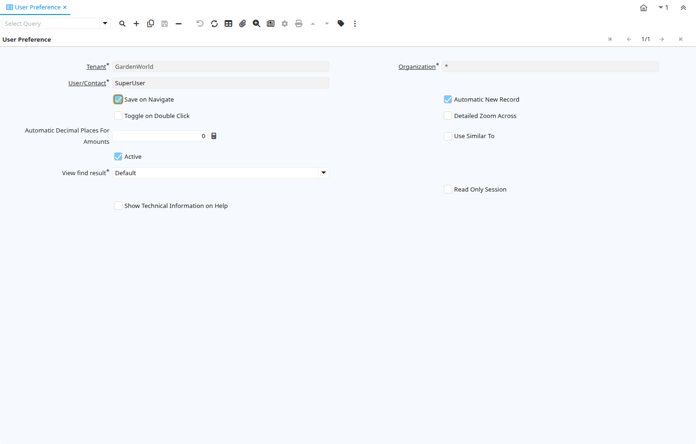

# User Preference

Window ID 200073

*18/04/2015 → 18/04/2015*

**Description:** This window is use to set up the preferences entries for each user.

## Tab: User Preference

*Tab Level 0 · Created 18/04/2015 · Updated 12/05/2022*

| **Name** | **Description** | **Comment/Help** | **Technical Data** |
|---|---|---|---|
| Tenant | Tenant for this installation. | A Tenant is a company or a legal entity. You cannot share data between Tenants. | AD_UserPreference.AD_Client_ID<small> numeric(10)   Table Direct</small> |
| Organization | Organizational entity within tenant | An organization is a unit of your tenant or legal entity - examples are store, department. You can share data between organizations. | AD_UserPreference.AD_Org_ID<small> numeric(10)   Table Direct</small> |
| User/Contact | User within the system - Internal or Business Partner Contact | The User identifies a unique user in the system. This could be an internal user or a business partner contact | AD_UserPreference.AD_User_ID<small> numeric(10)   Search</small> |
| Save on Navigate | Automatically save changes to the current record upon user navigation. | Automatically save changes to the current record when the user navigates to another record, switches to a detail tab, or performs an action (e.g., running a process) that requires saving the current changes. | AD_UserPreference.AutoCommit<small> character(1)   Yes-No</small> |
| Automatic New Record |  |  | AD_UserPreference.AutoNew<small> character(1)   Yes-No</small> |
| Toggle on Double Click | Defines if double click in a field on grid mode switch to form view | Defines if double click in a field on grid mode switch to form view | AD_UserPreference.ToggleOnDoubleClick<small> character(1)   Yes-No</small> |
| Detailed Zoom Across |  | The toolbar button zoom across discover where the record on screen is used on first tabs of windows.  With detailed zoom across it goes deeper in the discovery of relationships within detailed tabs. | AD_UserPreference.IsDetailedZoomAcross<small> character(1)   Yes-No</small> |
| Automatic Decimal Places For Amounts | Automatically insert a decimal point | i.e. "Entering 2 only results in a value of 0.02 for the entry. If you use the "." key during entry of a value, the decimal point is included at the place you specify. This mode has no effect on multiplication and division operations. If 0 is entered it will work as usual." | AD_UserPreference.AutomaticDecimalPlacesForAmoun<small> numeric(10)   Integer</small> |
| Use Similar To |  | In PostgreSQL database enable using the more powerful SIMILAR TO instead of LIKE for matching queries. | AD_UserPreference.IsUseSimilarTo<small> character(1)   Yes-No</small> |
| Active | The record is active in the system | There are two methods of making records unavailable in the system: One is to delete the record, the other is to de-activate the record. A de-activated record is not available for selection, but available for reports. There are two reasons for de-activating and not deleting records: (1) The system requires the record for audit purposes. (2) The record is referenced by other records. E.g., you cannot delete a Business Partner, if there are invoices for this partner record existing. You de-activate the Business Partner and prevent that this record is used for future entries. | AD_UserPreference.IsActive<small> character(1)   Yes-No</small> |
| View find result | Does the system must switch to grid mode after the Find panel closes |  | AD_UserPreference.ViewFindResult<small> character(1)   List</small> |
| Threshold | Force grid view when Find panel closes if number of records exceed threshold |  | AD_UserPreference.GridAfterFindThreshold<small> numeric(10)   Integer</small> |
| Migration Script Comment |  |  | AD_UserPreference.MigrationScriptComment<small> character varying(255)   String</small> |
| Read Only Session |  |  | AD_UserPreference.IsReadOnlySession<small> character(1)   Yes-No</small> |
| Show Technical Information on Help |  |  | AD_UserPreference.IsShowTechnicalInfOnHelp<small> character(1)   Yes-No</small> |

