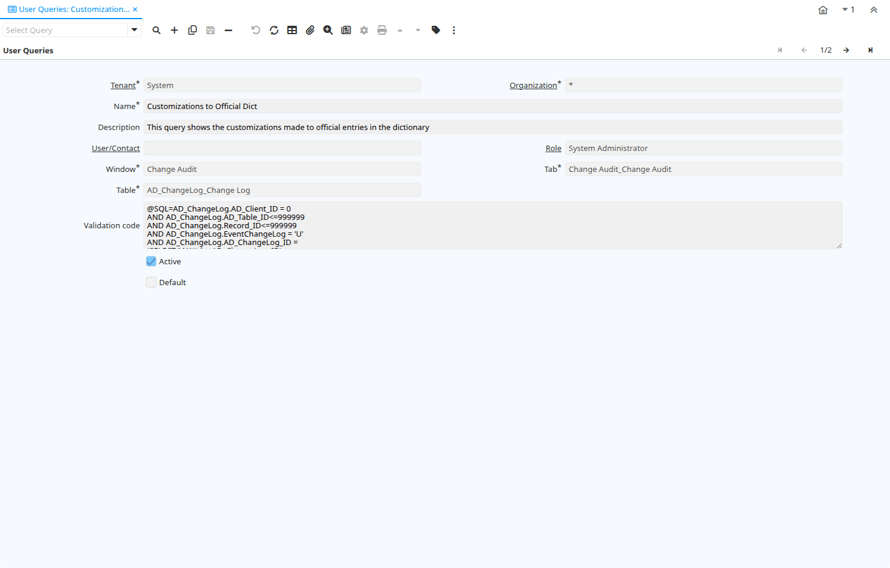

# User Queries

Window ID 200109

*13/11/2019 → 13/11/2019*

**Description:** View and maintain saved queries

## Tab: User Queries

*Tab Level 0 · Created 13/11/2019 · Updated 04/04/2024*

**Description:** View and maintain saved queries

| **Name** | **Description** | **Comment/Help** | **Technical Data** |
|---|---|---|---|
| Tenant | Tenant for this installation. | A Tenant is a company or a legal entity. You cannot share data between Tenants. | AD_UserQuery.AD_Client_ID<small> numeric(10)   Table Direct</small> |
| Organization | Organizational entity within tenant | An organization is a unit of your tenant or legal entity - examples are store, department. You can share data between organizations. | AD_UserQuery.AD_Org_ID<small> numeric(10)   Table Direct</small> |
| Name | Alphanumeric identifier of the entity | The name of an entity (record) is used as an default search option in addition to the search key. The name is up to 60 characters in length. | AD_UserQuery.Name<small> character varying(60)   String</small> |
| Description | Optional short description of the record | A description is limited to 255 characters. | AD_UserQuery.Description<small> character varying(255)   String</small> |
| User/Contact | User within the system - Internal or Business Partner Contact | The User identifies a unique user in the system. This could be an internal user or a business partner contact | AD_UserQuery.AD_User_ID<small> numeric(10)   Search</small> |
| Role | Responsibility Role | The Role determines security and access a user who has this Role will have in the System. | AD_UserQuery.AD_Role_ID<small> numeric(10)   Table Direct</small> |
| Window | Data entry or display window | The Window field identifies a unique Window in the system. | AD_UserQuery.AD_Window_ID<small> numeric(10)   Table Direct</small> |
| Tab | Tab within a Window | The Tab indicates a tab that displays within a window. | AD_UserQuery.AD_Tab_ID<small> numeric(10)   Table Direct</small> |
| Table | Database Table information | The Database Table provides the information of the table definition | AD_UserQuery.AD_Table_ID<small> numeric(10)   Table Direct</small> |
| Validation code | Validation Code | The Validation Code displays the date, time and message of the error.  You can add advanced SQL queries to your searches by filling this field with @SQL=[WHERE CLAUSE]. Do not include the WHERE statement and use Fully qualified SQL statements. F.e:  @SQL=C_Order.isActive='Y' AND SalesRep_ID=@AD_User_ID@   will filter orders by active and where the sales representative is the current user. | AD_UserQuery.Code<small> character varying(4000)   String</small> |
| Active | The record is active in the system | There are two methods of making records unavailable in the system: One is to delete the record, the other is to de-activate the record. A de-activated record is not available for selection, but available for reports. There are two reasons for de-activating and not deleting records: (1) The system requires the record for audit purposes. (2) The record is referenced by other records. E.g., you cannot delete a Business Partner, if there are invoices for this partner record existing. You de-activate the Business Partner and prevent that this record is used for future entries. | AD_UserQuery.IsActive<small> character(1)   Yes-No</small> |
| Default | Default value | The Default Checkbox indicates if this record will be used as a default value. | AD_UserQuery.IsDefault<small> character(1)   Yes-No</small> |

