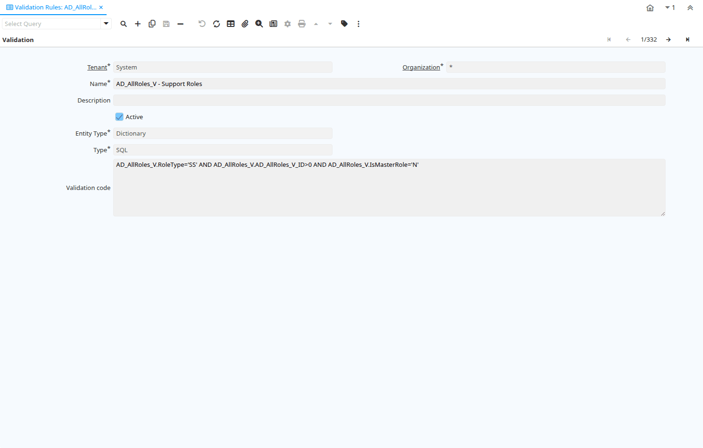

# Validation Rules

Window ID 103

*21/05/1999 → 02/01/2000*

**Description:** Maintain dynamic Validation Rules for columns and fields

**Comment/Help:** The Validation Rules Window defines all dynamic rules used when entering and maintaining columns and fields.  This window is for System Admin use only.

## Tab: Validation

*Tab Level 0 · Created 21/05/1999 · Updated 24/08/2022*

**Description:** Validation Rules

**Comment/Help:** The Validation Rules Tab defines all dynamic rules used when entering and maintaining columns and fields.

| **Name** | **Description** | **Comment/Help** | **Technical Data** |
|---|---|---|---|
| Tenant | Tenant for this installation. | A Tenant is a company or a legal entity. You cannot share data between Tenants. | AD_Val_Rule.AD_Client_ID<small> numeric(10)   Table Direct</small> |
| Organization | Organizational entity within tenant | An organization is a unit of your tenant or legal entity - examples are store, department. You can share data between organizations. | AD_Val_Rule.AD_Org_ID<small> numeric(10)   Table Direct</small> |
| Name | Alphanumeric identifier of the entity | The name of an entity (record) is used as an default search option in addition to the search key. The name is up to 60 characters in length. | AD_Val_Rule.Name<small> character varying(60)   String</small> |
| Description | Optional short description of the record | A description is limited to 255 characters. | AD_Val_Rule.Description<small> character varying(255)   String</small> |
| Active | The record is active in the system | There are two methods of making records unavailable in the system: One is to delete the record, the other is to de-activate the record. A de-activated record is not available for selection, but available for reports. There are two reasons for de-activating and not deleting records: (1) The system requires the record for audit purposes. (2) The record is referenced by other records. E.g., you cannot delete a Business Partner, if there are invoices for this partner record existing. You de-activate the Business Partner and prevent that this record is used for future entries. | AD_Val_Rule.IsActive<small> character(1)   Yes-No</small> |
| Entity Type | Dictionary Entity Type; Determines ownership and synchronization | The Entity Types "Dictionary", "iDempiere" and "Application" might be automatically synchronized and customizations deleted or overwritten.    For customizations, copy the entity and select "User"! | AD_Val_Rule.EntityType<small> character varying(40)   Table</small> |
| Type | Type of Validation (SQL, Java Script, Java Language) | The Type indicates the type of validation that will occur.  This can be SQL, Java Script or Java Language. | AD_Val_Rule.Type<small> character(1)   List</small> |
| Validation code | Validation Code | The Validation Code displays the date, time and message of the error. | AD_Val_Rule.Code<small> character varying(4000)   String</small> |

## Tab: › Used in Column

*Tab Level 1 · Created 27/10/2005 · Updated 27/10/2005*

**Description:** Used in Column

| **Name** | **Description** | **Comment/Help** | **Technical Data** |
|---|---|---|---|
| Tenant | Tenant for this installation. | A Tenant is a company or a legal entity. You cannot share data between Tenants. | AD_Column.AD_Client_ID<small> numeric(10)   Table Direct</small> |
| Organization | Organizational entity within tenant | An organization is a unit of your tenant or legal entity - examples are store, department. You can share data between organizations. | AD_Column.AD_Org_ID<small> numeric(10)   Table Direct</small> |
| Table | Database Table information | The Database Table provides the information of the table definition | AD_Column.AD_Table_ID<small> numeric(10)   Table Direct</small> |
| DB Column Name | Name of the column in the database | The Column Name indicates the name of a column on a table as defined in the database. | AD_Column.ColumnName<small> character varying(63)   String</small> |
| System Element | System Element enables the central maintenance of column description and help. | The System Element allows for the central maintenance of help, descriptions and terminology for a database column. | AD_Column.AD_Element_ID<small> numeric(10)   Search</small> |
| Name | Alphanumeric identifier of the entity | The name of an entity (record) is used as an default search option in addition to the search key. The name is up to 60 characters in length. | AD_Column.Name<small> character varying(60)   String</small> |
| Description | Optional short description of the record | A description is limited to 255 characters. | AD_Column.Description<small> character varying(255)   String</small> |
| Comment/Help | Comment or Hint | The Help field contains a hint, comment or help about the use of this item. | AD_Column.Help<small> character varying(2000)   Text</small> |
| Active | The record is active in the system | There are two methods of making records unavailable in the system: One is to delete the record, the other is to de-activate the record. A de-activated record is not available for selection, but available for reports. There are two reasons for de-activating and not deleting records: (1) The system requires the record for audit purposes. (2) The record is referenced by other records. E.g., you cannot delete a Business Partner, if there are invoices for this partner record existing. You de-activate the Business Partner and prevent that this record is used for future entries. | AD_Column.IsActive<small> character(1)   Yes-No</small> |
| Length | Length of the column in the database | The Length indicates the length of a column as defined in the database. | AD_Column.FieldLength<small> numeric(10)   Integer</small> |
| Reference | System Reference and Validation | The Reference could be a display type, list or table validation. | AD_Column.AD_Reference_ID<small> numeric(10)   Table</small> |
| Reference Key | Required to specify, if data type is Table or List | The Reference Value indicates where the reference values are stored.  It must be specified if the data type is Table or List.   | AD_Column.AD_Reference_Value_ID<small> numeric(10)   Table</small> |
| Dynamic Validation | Dynamic Validation Rule | These rules define how an entry is determined to valid. You can use variables for dynamic (context sensitive) validation. | AD_Column.AD_Val_Rule_ID<small> numeric(10)   Table Direct</small> |

## Tab: › Used in Column (Lookup)

*Tab Level 1 · Created 22/06/2019 · Updated 24/02/2022*

**Description:** Used in Column (Lookup)

| **Name** | **Description** | **Comment/Help** | **Technical Data** |
|---|---|---|---|
| Table | Database Table information | The Database Table provides the information of the table definition | AD_Column.AD_Table_ID<small> numeric(10)   Table Direct</small> |
| Column | Column in the table | Link to the database column of the table | AD_Column.AD_Column_ID<small> numeric(10)   ID</small> |
| DB Column Name | Name of the column in the database | The Column Name indicates the name of a column on a table as defined in the database. | AD_Column.ColumnName<small> character varying(63)   String</small> |

