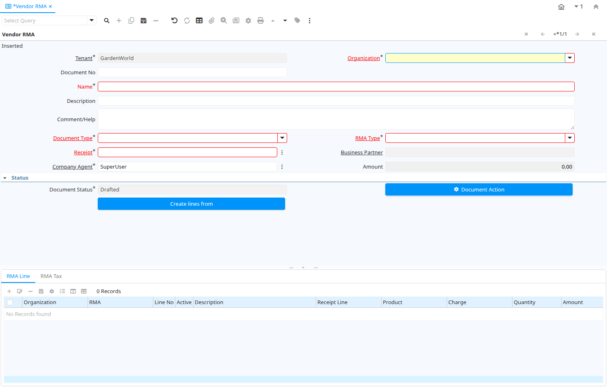

# Vendor RMA

Window ID 53099

*11/09/2009 → 11/09/2009*

**Description:** Manage Return Material Authorization

**Comment/Help:** A Return Material Authorization may be required to accept returns and to create Credit Memos

## Tab: Vendor RMA

*Tab Level 0 · Created 11/09/2009 · Updated 30/09/2009*

**Description:** Vendor Return Material Authorization

**Comment/Help:** A Return Material Authorization may be required to accept returns and to create Credit Memos

| **Name** | **Description** | **Comment/Help** | **Technical Data** |
|---|---|---|---|
| Tenant | Tenant for this installation. | A Tenant is a company or a legal entity. You cannot share data between Tenants. | M_RMA.AD_Client_ID<small> numeric(10)   Table Direct</small> |
| Organization | Organizational entity within tenant | An organization is a unit of your tenant or legal entity - examples are store, department. You can share data between organizations. | M_RMA.AD_Org_ID<small> numeric(10)   Table Direct</small> |
| Document No | Document sequence number of the document | The document number is usually automatically generated by the system and determined by the document type of the document. If the document is not saved, the preliminary number is displayed in "&lt;&gt;".  If the document type of your document has no automatic document sequence defined, the field is empty if you create a new document. This is for documents which usually have an external number (like vendor invoice).  If you leave the field empty, the system will generate a document number for you. The document sequence used for this fallback number is defined in the "Maintain Sequence" window with the name "DocumentNo_&lt;TableName&gt;", where TableName is the actual name of the table (e.g. C_Order). | M_RMA.DocumentNo<small> character varying(30)   String</small> |
| Name | Alphanumeric identifier of the entity | The name of an entity (record) is used as an default search option in addition to the search key. The name is up to 60 characters in length. | M_RMA.Name<small> character varying(60)   String</small> |
| Description | Optional short description of the record | A description is limited to 255 characters. | M_RMA.Description<small> character varying(255)   String</small> |
| Comment/Help | Comment or Hint | The Help field contains a hint, comment or help about the use of this item. | M_RMA.Help<small> character varying(2000)   Text</small> |
| Document Type | Document type or rules | The Document Type determines document sequence and processing rules | M_RMA.C_DocType_ID<small> numeric(10)   Table</small> |
| RMA Type | Return Material Authorization Type | Types of RMA | M_RMA.M_RMAType_ID<small> numeric(10)   Table Direct</small> |
| Receipt | Material Receipt Document | The Material Shipment / Receipt  | M_RMA.InOut_ID<small> numeric(10)   Search</small> |
| Business Partner | Identifies a Business Partner | A Business Partner is anyone with whom you transact.  This can include Vendor, Customer, Employee or Salesperson | M_RMA.C_BPartner_ID<small> numeric(10)   Search</small> |
| Company Agent | Purchase or Company Agent | Purchase agent for the document. Any Sales Rep must be a valid internal user. | M_RMA.SalesRep_ID<small> numeric(10)   Search</small> |
| Amount | Amount | Amount | M_RMA.Amt<small> numeric   Amount</small> |
| Document Status | The current status of the document | The Document Status indicates the status of a document at this time.  If you want to change the document status, use the Document Action field | M_RMA.DocStatus<small> character(2)   List</small> |
| Process RMA |  |  | M_RMA.DocAction<small> character(2)   Button</small> |
| Purchase Order | Purchase Order | The Purchase Order is a control document.  The Purchase Order is complete when the quantity ordered is the same as the quantity shipped and invoiced.  When you close an order, unshipped (backordered) quantities are cancelled. | M_RMA.C_Order_ID<small> numeric(10)   Search</small> |
| Create lines from | Process which will generate a new document lines based on an existing document | The Create From process will create a new document based on information in an existing document selected by the user. | M_RMA.CreateLinesFrom<small> character(1)   Button</small> |
| Create Order From RMA | Creates an order based on this RMA Document. The RMA should be correct and completed. | Generate Order from RMA will create an order based on this RMA document. | M_RMA.GenerateTo<small> character(1)   Button</small> |

## Tab: › RMA Line

*Tab Level 1 · Created 11/09/2009 · Updated 16/03/2021*

**Description:** Return Material Authorization Line

**Comment/Help:** Detail information about the returned goods

| **Name** | **Description** | **Comment/Help** | **Technical Data** |
|---|---|---|---|
| Tenant | Tenant for this installation. | A Tenant is a company or a legal entity. You cannot share data between Tenants. | M_RMALine.AD_Client_ID<small> numeric(10)   Table Direct</small> |
| Organization | Organizational entity within tenant | An organization is a unit of your tenant or legal entity - examples are store, department. You can share data between organizations. | M_RMALine.AD_Org_ID<small> numeric(10)   Table Direct</small> |
| RMA | Return Material Authorization | A Return Material Authorization may be required to accept returns and to create Credit Memos | M_RMALine.M_RMA_ID<small> numeric(10)   Search</small> |
| Line No | Unique line for this document | Indicates the unique line for a document.  It will also control the display order of the lines within a document. | M_RMALine.Line<small> numeric(10)   Integer</small> |
| Active | The record is active in the system | There are two methods of making records unavailable in the system: One is to delete the record, the other is to de-activate the record. A de-activated record is not available for selection, but available for reports. There are two reasons for de-activating and not deleting records: (1) The system requires the record for audit purposes. (2) The record is referenced by other records. E.g., you cannot delete a Business Partner, if there are invoices for this partner record existing. You de-activate the Business Partner and prevent that this record is used for future entries. | M_RMALine.IsActive<small> character(1)   Yes-No</small> |
| Description | Optional short description of the record | A description is limited to 255 characters. | M_RMALine.Description<small> character varying(255)   String</small> |
| Receipt Line | Line on Receipt document |  | M_RMALine.M_InOutLine_ID<small> numeric(10)   Table Direct</small> |
| Product | Product, Service, Item | Identifies an item which is either purchased or sold in this organization. | M_RMALine.M_Product_ID<small> numeric(10)   Search</small> |
| Charge | Additional document charges | The Charge indicates a type of Charge (Handling, Shipping, Restocking) | M_RMALine.C_Charge_ID<small> numeric(10)   Table Direct</small> |
| Quantity | Quantity | The Quantity indicates the number of a specific product or item for this document. | M_RMALine.Qty<small> numeric   Quantity</small> |
| Amount | Amount | Amount | M_RMALine.Amt<small> numeric   Amount</small> |
| Tax | Tax identifier | The Tax indicates the type of tax used in document line. | M_RMALine.C_Tax_ID<small> numeric(10)   Table Direct</small> |
| Line Amount | Line Extended Amount (Quantity * Actual Price) without Freight and Charges | Indicates the extended line amount based on the quantity and the actual price.  Any additional charges or freight are not included.  The Amount may or may not include tax.  If the price list is inclusive tax, the line amount is the same as the line total. | M_RMALine.LineNetAmt<small> numeric   Amount</small> |
| Cost Center |  |  | M_RMALine.C_CostCenter_ID<small> numeric(10)   Table Direct</small> |
| Department |  |  | M_RMALine.C_Department_ID<small> numeric(10)   Table Direct</small> |

## Tab: › RMA Tax

*Tab Level 1 · Created 18/01/2013 · Updated 18/01/2013*

**Description:** RMA Tax

**Comment/Help:** The RMA Tax Tab displays the tax associated with the RMA Lines.

| **Name** | **Description** | **Comment/Help** | **Technical Data** |
|---|---|---|---|
| Tenant | Tenant for this installation. | A Tenant is a company or a legal entity. You cannot share data between Tenants. | M_RMATax.AD_Client_ID<small> numeric(10)   Table Direct</small> |
| Organization | Organizational entity within tenant | An organization is a unit of your tenant or legal entity - examples are store, department. You can share data between organizations. | M_RMATax.AD_Org_ID<small> numeric(10)   Table Direct</small> |
| RMA | Return Material Authorization | A Return Material Authorization may be required to accept returns and to create Credit Memos | M_RMATax.M_RMA_ID<small> numeric(10)   Search</small> |
| Tax | Tax identifier | The Tax indicates the type of tax used in document line. | M_RMATax.C_Tax_ID<small> numeric(10)   Table Direct</small> |
| Tax Provider |  |  | M_RMATax.C_TaxProvider_ID<small> numeric(10)   Table Direct</small> |
| Tax Amount | Tax Amount for a document | The Tax Amount displays the total tax amount for a document. | M_RMATax.TaxAmt<small> numeric   Amount</small> |
| Tax base Amount | Base for calculating the tax amount | The Tax Base Amount indicates the base amount used for calculating the tax amount. | M_RMATax.TaxBaseAmt<small> numeric   Amount</small> |
| Price includes Tax | Tax is included in the price  | The Tax Included checkbox indicates if the prices include tax.  This is also known as the gross price. | M_RMATax.IsTaxIncluded<small> character(1)   Yes-No</small> |

