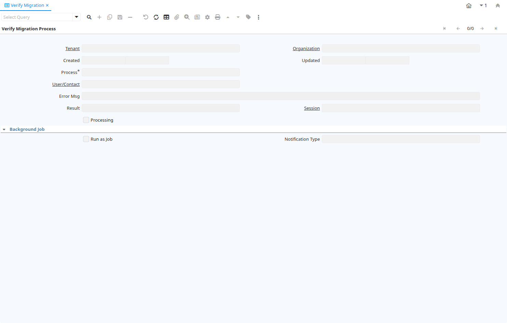

# Verify Migration

Window ID 200137

*13/01/2023 → 13/01/2023*

## Tab: Verify Migration Process

*Tab Level 0 · Created 13/01/2023 · Updated 13/01/2023*

| **Name** | **Description** | **Comment/Help** | **Technical Data** |
|---|---|---|---|
| Tenant | Tenant for this installation. | A Tenant is a company or a legal entity. You cannot share data between Tenants. | AD_PInstance.AD_Client_ID<small> numeric(10)   Table Direct</small> |
| Organization | Organizational entity within tenant | An organization is a unit of your tenant or legal entity - examples are store, department. You can share data between organizations. | AD_PInstance.AD_Org_ID<small> numeric(10)   Table Direct</small> |
| Created | Date this record was created | The Created field indicates the date that this record was created. | AD_PInstance.Created<small> timestamp without time zone   Date+Time</small> |
| Updated | Date this record was updated | The Updated field indicates the date that this record was updated. | AD_PInstance.Updated<small> timestamp without time zone   Date+Time</small> |
| Process | Process or Report | The Process field identifies a unique Process or Report in the system. | AD_PInstance.AD_Process_ID<small> numeric(10)   Table Direct</small> |
| User/Contact | User within the system - Internal or Business Partner Contact | The User identifies a unique user in the system. This could be an internal user or a business partner contact | AD_PInstance.AD_User_ID<small> numeric(10)   Table Direct</small> |
| Error Msg |  |  | AD_PInstance.ErrorMsg<small> character varying(2000)   String</small> |
| Result | Result of the action taken | The Result indicates the result of any action taken on this request. | AD_PInstance.Result<small> numeric(10)   Integer</small> |
| Session | User Session Online or Web | Online or Web Session Information | AD_PInstance.AD_Session_ID<small> numeric(10)   Search</small> |
| Processing |  |  | AD_PInstance.IsProcessing<small> character(1)   Yes-No</small> |
| Run as Job |  |  | AD_PInstance.IsRunAsJob<small> character(1)   Yes-No</small> |
| Notification Type | Type of Notifications | Emails or Notification sent out for Request Updates, etc. | AD_PInstance.NotificationType<small> character varying(2)   List</small> |

## Tab: › Verify Migration

*Tab Level 1 · Created 13/01/2023 · Updated 13/01/2023*

| **Name** | **Description** | **Comment/Help** | **Technical Data** |
|---|---|---|---|
| Tenant | Tenant for this installation. | A Tenant is a company or a legal entity. You cannot share data between Tenants. | AD_VerifyMigration.AD_Client_ID<small> numeric(10)   Search</small> |
| Organization | Organizational entity within tenant | An organization is a unit of your tenant or legal entity - examples are store, department. You can share data between organizations. | AD_VerifyMigration.AD_Org_ID<small> numeric(10)   Table Direct</small> |
| Process Instance | Instance of the process |  | AD_VerifyMigration.AD_PInstance_ID<small> numeric(10)   Search</small> |
| Sequence | Method of ordering records; lowest number comes first | The Sequence indicates the order of records | AD_VerifyMigration.SeqNo<small> numeric(10)   Integer</small> |
| Table | Database Table information | The Database Table provides the information of the table definition | AD_VerifyMigration.AD_Table_ID<small> numeric(10)   Table Direct</small> |
| Priority | Priority of a document | The Priority indicates the importance (high, medium, low) of this document | AD_VerifyMigration.PriorityRule<small> character(1)   List</small> |
| Column | Column in the table | Link to the database column of the table | AD_VerifyMigration.AD_Column_ID<small> numeric(10)   Table Direct</small> |
| Change Log | Log of data changes | Log of data changes | AD_VerifyMigration.AD_ChangeLog_ID<small> numeric(10)   Search</small> |
| Comment/Help | Comment or Hint | The Help field contains a hint, comment or help about the use of this item. | AD_VerifyMigration.Help<small> character varying(2000)   String</small> |
| Expected Value |  |  | AD_VerifyMigration.ExpectedValue<small> character varying(4000)   String</small> |
| Current Value |  |  | AD_VerifyMigration.CurrentValue<small> character varying(4000)   String</small> |
| Note | Note for manual entry | The Note allows for entry for additional information regarding a manual entry. | AD_VerifyMigration.ManualNote<small> character varying(4000)   String</small> |
| Ignore |  |  | AD_VerifyMigration.IsIgnore<small> character(1)   Yes-No</small> |
| Active | The record is active in the system | There are two methods of making records unavailable in the system: One is to delete the record, the other is to de-activate the record. A de-activated record is not available for selection, but available for reports. There are two reasons for de-activating and not deleting records: (1) The system requires the record for audit purposes. (2) The record is referenced by other records. E.g., you cannot delete a Business Partner, if there are invoices for this partner record existing. You de-activate the Business Partner and prevent that this record is used for future entries. | AD_VerifyMigration.IsActive<small> character(1)   Yes-No</small> |
| Record ID | Direct internal record ID | The Record ID is the internal unique identifier of a record. Please note that zooming to the record may not be successful for Orders, Invoices and Shipment/Receipts as sometimes the Sales Order type is not known. | AD_VerifyMigration.Record_ID<small> numeric(10)   Record ID</small> |

