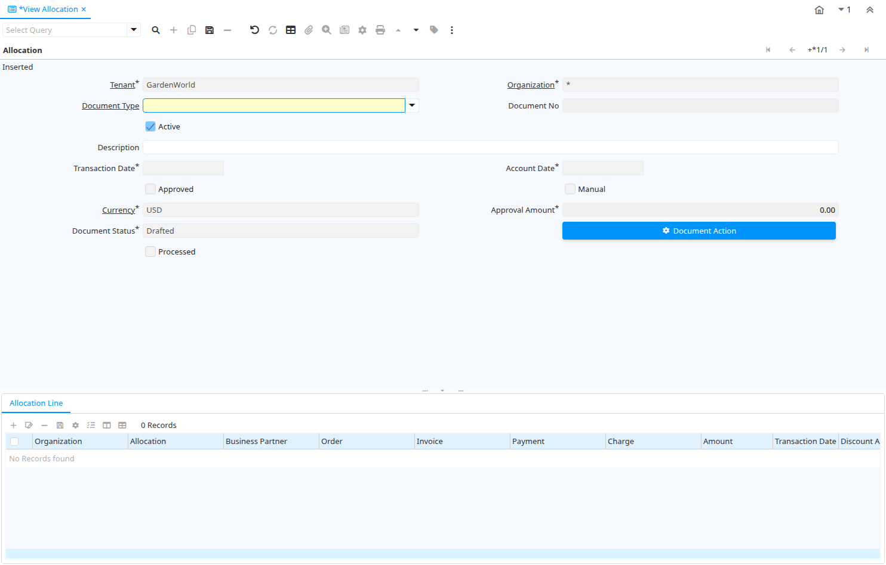

# View Allocation

Window ID 205

*24/01/2001 → 02/01/2000*

**Description:** View and Reverse Allocations 

**Comment/Help:** The Reverse Allocation Window allows you to view and reverse a payment allocation

## Tab: Allocation

*Tab Level 0 · Created 24/01/2001 · Updated 21/02/2005*

**Description:** View and Reverse Allocation

**Comment/Help:** The Reverse Allocation Tab defines the Payment Allocation to be reversed.

| **Name** | **Description** | **Comment/Help** | **Technical Data** |
|---|---|---|---|
| Tenant | Tenant for this installation. | A Tenant is a company or a legal entity. You cannot share data between Tenants. | C_AllocationHdr.AD_Client_ID<small> numeric(10)   Table Direct</small> |
| Organization | Organizational entity within tenant | An organization is a unit of your tenant or legal entity - examples are store, department. You can share data between organizations. | C_AllocationHdr.AD_Org_ID<small> numeric(10)   Table Direct</small> |
| Document Type | Document type or rules | The Document Type determines document sequence and processing rules | C_AllocationHdr.C_DocType_ID<small> numeric(10)   Table Direct</small> |
| Document No | Document sequence number of the document | The document number is usually automatically generated by the system and determined by the document type of the document. If the document is not saved, the preliminary number is displayed in "&lt;&gt;".  If the document type of your document has no automatic document sequence defined, the field is empty if you create a new document. This is for documents which usually have an external number (like vendor invoice).  If you leave the field empty, the system will generate a document number for you. The document sequence used for this fallback number is defined in the "Maintain Sequence" window with the name "DocumentNo_&lt;TableName&gt;", where TableName is the actual name of the table (e.g. C_Order). | C_AllocationHdr.DocumentNo<small> character varying(30)   String</small> |
| Active | The record is active in the system | There are two methods of making records unavailable in the system: One is to delete the record, the other is to de-activate the record. A de-activated record is not available for selection, but available for reports. There are two reasons for de-activating and not deleting records: (1) The system requires the record for audit purposes. (2) The record is referenced by other records. E.g., you cannot delete a Business Partner, if there are invoices for this partner record existing. You de-activate the Business Partner and prevent that this record is used for future entries. | C_AllocationHdr.IsActive<small> character(1)   Yes-No</small> |
| Description | Optional short description of the record | A description is limited to 255 characters. | C_AllocationHdr.Description<small> character varying(255)   String</small> |
| Transaction Date | Transaction Date | The Transaction Date indicates the date of the transaction. | C_AllocationHdr.DateTrx<small> timestamp without time zone   Date</small> |
| Account Date | Accounting Date | The Accounting Date indicates the date to be used on the General Ledger account entries generated from this document. It is also used for any currency conversion. | C_AllocationHdr.DateAcct<small> timestamp without time zone   Date</small> |
| Approved | Indicates if this document requires approval | The Approved checkbox indicates if this document requires approval before it can be processed. | C_AllocationHdr.IsApproved<small> character(1)   Yes-No</small> |
| Manual | This is a manual process | The Manual check box indicates if the process will done manually. | C_AllocationHdr.IsManual<small> character(1)   Yes-No</small> |
| Currency | The Currency for this record | Indicates the Currency to be used when processing or reporting on this record | C_AllocationHdr.C_Currency_ID<small> numeric(10)   Table Direct</small> |
| Approval Amount | Document Approval Amount | Approval Amount for Workflow | C_AllocationHdr.ApprovalAmt<small> numeric   Amount</small> |
| Document Status | The current status of the document | The Document Status indicates the status of a document at this time.  If you want to change the document status, use the Document Action field | C_AllocationHdr.DocStatus<small> character(2)   List</small> |
| Process Allocation |  |  | C_AllocationHdr.DocAction<small> character(2)   Button</small> |
| Processed | The document has been processed | The Processed checkbox indicates that a document has been processed. | C_AllocationHdr.Processed<small> character(1)   Yes-No</small> |
| Posted | Posting status | The Posted field indicates the status of the Generation of General Ledger Accounting Lines  | C_AllocationHdr.Posted<small> character(1)   Button</small> |
| Reset Allocation Direct | Reset (delete) allocation of invoices to payments | Delete individual allocation. In contrast to "Reverse", the allocation is deleted (no trace), if the period is open. | C_AllocationHdr.Processing<small> character(1)   Button</small> |

## Tab: › Allocation Line

*Tab Level 1 · Created 24/01/2001 · Updated 02/01/2000*

**Description:** View Allocation Lines

**Comment/Help:** View Allocation Line Details

| **Name** | **Description** | **Comment/Help** | **Technical Data** |
|---|---|---|---|
| Tenant | Tenant for this installation. | A Tenant is a company or a legal entity. You cannot share data between Tenants. | C_AllocationLine.AD_Client_ID<small> numeric(10)   Table Direct</small> |
| Organization | Organizational entity within tenant | An organization is a unit of your tenant or legal entity - examples are store, department. You can share data between organizations. | C_AllocationLine.AD_Org_ID<small> numeric(10)   Table Direct</small> |
| Allocation | Payment allocation |  | C_AllocationLine.C_AllocationHdr_ID<small> numeric(10)   Search</small> |
| Business Partner | Identifies a Business Partner | A Business Partner is anyone with whom you transact.  This can include Vendor, Customer, Employee or Salesperson | C_AllocationLine.C_BPartner_ID<small> numeric(10)   Search</small> |
| Order | Order | The Order is a control document.  The  Order is complete when the quantity ordered is the same as the quantity shipped and invoiced.  When you close an order, unshipped (backordered) quantities are cancelled. | C_AllocationLine.C_Order_ID<small> numeric(10)   Search</small> |
| Invoice | Invoice Identifier | The Invoice Document. | C_AllocationLine.C_Invoice_ID<small> numeric(10)   Search</small> |
| Payment | Payment identifier | The Payment is a unique identifier of this payment. | C_AllocationLine.C_Payment_ID<small> numeric(10)   Search</small> |
| Charge | Additional document charges | The Charge indicates a type of Charge (Handling, Shipping, Restocking) | C_AllocationLine.C_Charge_ID<small> numeric(10)   Table Direct</small> |
| Amount | Amount in a defined currency | The Amount indicates the amount for this document line. | C_AllocationLine.Amount<small> numeric   Amount</small> |
| Transaction Date | Transaction Date | The Transaction Date indicates the date of the transaction. | C_AllocationLine.DateTrx<small> timestamp without time zone   Date</small> |
| Discount Amount | Calculated amount of discount | The Discount Amount indicates the discount amount for a document or line. | C_AllocationLine.DiscountAmt<small> numeric   Amount</small> |
| Write-off Amount | Amount to write-off | The Write Off Amount indicates the amount to be written off as uncollectible. | C_AllocationLine.WriteOffAmt<small> numeric   Amount</small> |
| Over/Under Payment | Over-Payment (unallocated) or Under-Payment (partial payment) Amount | Overpayments (negative) are unallocated amounts and allow you to receive money for more than the particular invoice.  Underpayments (positive) is a partial payment for the invoice. You do not write off the unpaid amount. | C_AllocationLine.OverUnderAmt<small> numeric   Amount</small> |

