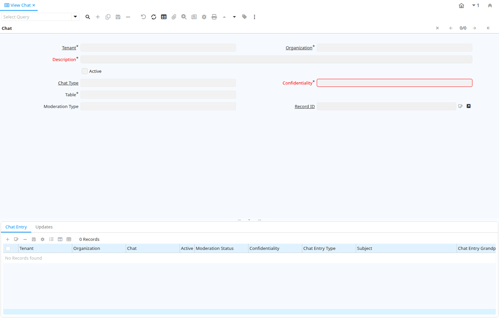

# View Chat

Window ID 377

*05/04/2006 → 18/04/2006*

**Description:** View discussions / chats

**Comment/Help:** View chat / discussion threads

## Tab: Chat

*Tab Level 0 · Created 18/04/2006 · Updated 18/04/2006*

**Description:** View Chat or discussion thread

**Comment/Help:** Thread of discussion

| **Name** | **Description** | **Comment/Help** | **Technical Data** |
|---|---|---|---|
| Tenant | Tenant for this installation. | A Tenant is a company or a legal entity. You cannot share data between Tenants. | CM_Chat.AD_Client_ID<small> numeric(10)   Table Direct</small> |
| Organization | Organizational entity within tenant | An organization is a unit of your tenant or legal entity - examples are store, department. You can share data between organizations. | CM_Chat.AD_Org_ID<small> numeric(10)   Table Direct</small> |
| Description | Optional short description of the record | A description is limited to 255 characters. | CM_Chat.Description<small> character varying(255)   String</small> |
| Active | The record is active in the system | There are two methods of making records unavailable in the system: One is to delete the record, the other is to de-activate the record. A de-activated record is not available for selection, but available for reports. There are two reasons for de-activating and not deleting records: (1) The system requires the record for audit purposes. (2) The record is referenced by other records. E.g., you cannot delete a Business Partner, if there are invoices for this partner record existing. You de-activate the Business Partner and prevent that this record is used for future entries. | CM_Chat.IsActive<small> character(1)   Yes-No</small> |
| Chat Type | Type of discussion / chat | Chat Type allows you to receive subscriptions for particular content of discussions. It is linked to a table. | CM_Chat.CM_ChatType_ID<small> numeric(10)   Table Direct</small> |
| Confidentiality | Type of Confidentiality |  | CM_Chat.ConfidentialType<small> character(1)   List</small> |
| Table | Database Table information | The Database Table provides the information of the table definition | CM_Chat.AD_Table_ID<small> numeric(10)   Table Direct</small> |
| Record UUID |  |  | CM_Chat.Record_UU<small> uuid   Record UUID</small> |
| Moderation Type | Type of moderation |  | CM_Chat.ModerationType<small> character(1)   List</small> |
| Record ID | Direct internal record ID | The Record ID is the internal unique identifier of a record. Please note that zooming to the record may not be successful for Orders, Invoices and Shipment/Receipts as sometimes the Sales Order type is not known. | CM_Chat.Record_ID<small> numeric(10)   Record ID</small> |

## Tab: › Chat Entry

*Tab Level 1 · Created 18/04/2006 · Updated 18/04/2006*

**Description:** Individual Chat / Discussion Entry

**Comment/Help:** The entry can not be changed - just the confidentiality

| **Name** | **Description** | **Comment/Help** | **Technical Data** |
|---|---|---|---|
| Tenant | Tenant for this installation. | A Tenant is a company or a legal entity. You cannot share data between Tenants. | CM_ChatEntry.AD_Client_ID<small> numeric(10)   Table Direct</small> |
| Organization | Organizational entity within tenant | An organization is a unit of your tenant or legal entity - examples are store, department. You can share data between organizations. | CM_ChatEntry.AD_Org_ID<small> numeric(10)   Table Direct</small> |
| Chat | Chat or discussion thread | Thread of discussion | CM_ChatEntry.CM_Chat_ID<small> numeric(10)   Table Direct</small> |
| Active | The record is active in the system | There are two methods of making records unavailable in the system: One is to delete the record, the other is to de-activate the record. A de-activated record is not available for selection, but available for reports. There are two reasons for de-activating and not deleting records: (1) The system requires the record for audit purposes. (2) The record is referenced by other records. E.g., you cannot delete a Business Partner, if there are invoices for this partner record existing. You de-activate the Business Partner and prevent that this record is used for future entries. | CM_ChatEntry.IsActive<small> character(1)   Yes-No</small> |
| Moderation Status | Status of Moderation |  | CM_ChatEntry.ModeratorStatus<small> character(1)   List</small> |
| Confidentiality | Type of Confidentiality |  | CM_ChatEntry.ConfidentialType<small> character(1)   List</small> |
| Chat Entry Type | Type of Chat/Forum Entry |  | CM_ChatEntry.ChatEntryType<small> character(1)   List</small> |
| Subject | Email Message Subject | Subject of the EMail  | CM_ChatEntry.Subject<small> character varying(255)   String</small> |
| Chat Entry Grandparent | Link to Grand Parent (root level) |  | CM_ChatEntry.CM_ChatEntryGrandParent_ID<small> numeric(10)   Table</small> |
| Chat Entry Parent | Link to direct Parent |  | CM_ChatEntry.CM_ChatEntryParent_ID<small> numeric(10)   Table</small> |
| Character Data | Long Character Field |  | CM_ChatEntry.CharacterData<small> text   Text Long</small> |
| User/Contact | User within the system - Internal or Business Partner Contact | The User identifies a unique user in the system. This could be an internal user or a business partner contact | CM_ChatEntry.AD_User_ID<small> numeric(10)   Table Direct</small> |

## Tab: › Updates

*Tab Level 1 · Created 18/04/2006 · Updated 18/04/2006*

**Description:** Subscribers for this Chat

**Comment/Help:** Subscribers receive updates per email or notice. In addition to the subscribers for this specific cta, also the subscribers of the Chat Type receive updates.

| **Name** | **Description** | **Comment/Help** | **Technical Data** |
|---|---|---|---|
| Tenant | Tenant for this installation. | A Tenant is a company or a legal entity. You cannot share data between Tenants. | CM_ChatUpdate.AD_Client_ID<small> numeric(10)   Table Direct</small> |
| Organization | Organizational entity within tenant | An organization is a unit of your tenant or legal entity - examples are store, department. You can share data between organizations. | CM_ChatUpdate.AD_Org_ID<small> numeric(10)   Table Direct</small> |
| Chat | Chat or discussion thread | Thread of discussion | CM_ChatUpdate.CM_Chat_ID<small> numeric(10)   Table Direct</small> |
| User/Contact | User within the system - Internal or Business Partner Contact | The User identifies a unique user in the system. This could be an internal user or a business partner contact | CM_ChatUpdate.AD_User_ID<small> numeric(10)   Table Direct</small> |
| Active | The record is active in the system | There are two methods of making records unavailable in the system: One is to delete the record, the other is to de-activate the record. A de-activated record is not available for selection, but available for reports. There are two reasons for de-activating and not deleting records: (1) The system requires the record for audit purposes. (2) The record is referenced by other records. E.g., you cannot delete a Business Partner, if there are invoices for this partner record existing. You de-activate the Business Partner and prevent that this record is used for future entries. | CM_ChatUpdate.IsActive<small> character(1)   Yes-No</small> |
| Self-Service | This is a Self-Service entry or this entry can be changed via Self-Service | Self-Service allows users to enter data or update their data.  The flag indicates, that this record was entered or created via Self-Service or that the user can change it via the Self-Service functionality. | CM_ChatUpdate.IsSelfService<small> character(1)   Yes-No</small> |

