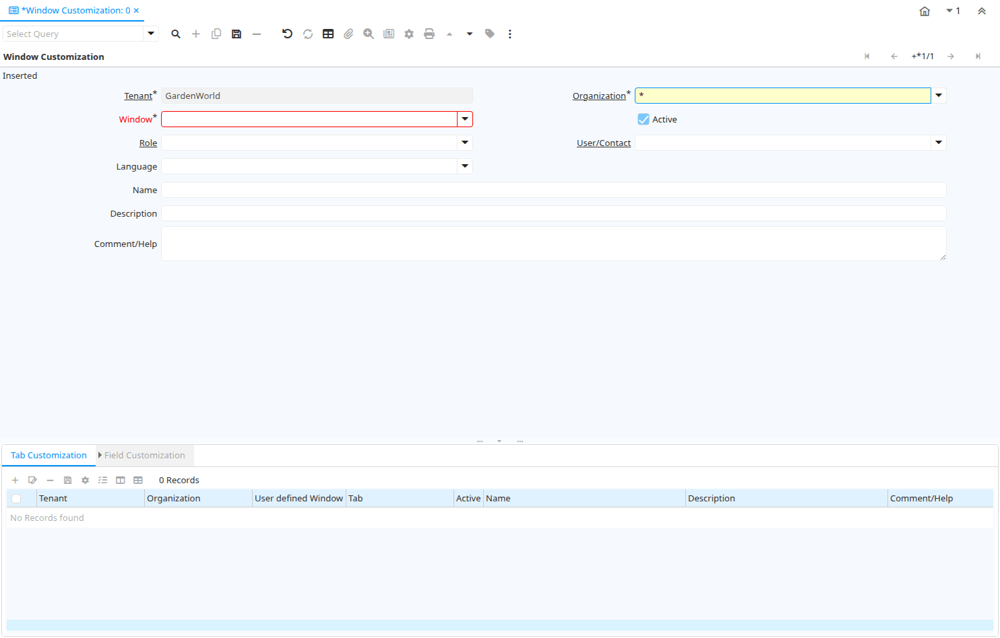

# Window Customization

Window ID 229

*05/09/2001 → 20/09/2023*

**Description:** Define Window Customization for Role/User

**Comment/Help:** The customization values defined here overwrite/replace the default system definition if defined.

## Tab: Window Customization

*Tab Level 0 · Created 05/09/2001 · Updated 27/10/2024*

| **Name** | **Description** | **Comment/Help** | **Technical Data** |
|---|---|---|---|
| Tenant | Tenant for this installation. | A Tenant is a company or a legal entity. You cannot share data between Tenants. | AD_UserDef_Win.AD_Client_ID<small> numeric(10)   Table Direct</small> |
| Organization | Organizational entity within tenant | An organization is a unit of your tenant or legal entity - examples are store, department. You can share data between organizations. | AD_UserDef_Win.AD_Org_ID<small> numeric(10)   Table Direct</small> |
| Window | Data entry or display window | The Window field identifies a unique Window in the system. | AD_UserDef_Win.AD_Window_ID<small> numeric(10)   Table Direct</small> |
| Active | The record is active in the system | There are two methods of making records unavailable in the system: One is to delete the record, the other is to de-activate the record. A de-activated record is not available for selection, but available for reports. There are two reasons for de-activating and not deleting records: (1) The system requires the record for audit purposes. (2) The record is referenced by other records. E.g., you cannot delete a Business Partner, if there are invoices for this partner record existing. You de-activate the Business Partner and prevent that this record is used for future entries. | AD_UserDef_Win.IsActive<small> character(1)   Yes-No</small> |
| Role | Responsibility Role | The Role determines security and access a user who has this Role will have in the System. | AD_UserDef_Win.AD_Role_ID<small> numeric(10)   Table Direct</small> |
| User/Contact | User within the system - Internal or Business Partner Contact | The User identifies a unique user in the system. This could be an internal user or a business partner contact | AD_UserDef_Win.AD_User_ID<small> numeric(10)   Table Direct</small> |
| Language | Language for this entity | The Language identifies the language to use for display and formatting | AD_UserDef_Win.AD_Language<small> character varying(6)   Table</small> |
| Name | Alphanumeric identifier of the entity | The name of an entity (record) is used as an default search option in addition to the search key. The name is up to 60 characters in length. | AD_UserDef_Win.Name<small> character varying(60)   String</small> |
| Description | Optional short description of the record | A description is limited to 255 characters. | AD_UserDef_Win.Description<small> character varying(255)   String</small> |
| Comment/Help | Comment or Hint | The Help field contains a hint, comment or help about the use of this item. | AD_UserDef_Win.Help<small> character varying(2000)   Text</small> |

## Tab: › Tab Customization

*Tab Level 1 · Created 05/09/2001 · Updated 27/10/2024*

| **Name** | **Description** | **Comment/Help** | **Technical Data** |
|---|---|---|---|
| Tenant | Tenant for this installation. | A Tenant is a company or a legal entity. You cannot share data between Tenants. | AD_UserDef_Tab.AD_Client_ID<small> numeric(10)   Table Direct</small> |
| Organization | Organizational entity within tenant | An organization is a unit of your tenant or legal entity - examples are store, department. You can share data between organizations. | AD_UserDef_Tab.AD_Org_ID<small> numeric(10)   Table Direct</small> |
| User defined Window |  |  | AD_UserDef_Tab.AD_UserDef_Win_ID<small> numeric(10)   Table Direct</small> |
| Tab | Tab within a Window | The Tab indicates a tab that displays within a window. | AD_UserDef_Tab.AD_Tab_ID<small> numeric(10)   Table Direct</small> |
| Active | The record is active in the system | There are two methods of making records unavailable in the system: One is to delete the record, the other is to de-activate the record. A de-activated record is not available for selection, but available for reports. There are two reasons for de-activating and not deleting records: (1) The system requires the record for audit purposes. (2) The record is referenced by other records. E.g., you cannot delete a Business Partner, if there are invoices for this partner record existing. You de-activate the Business Partner and prevent that this record is used for future entries. | AD_UserDef_Tab.IsActive<small> character(1)   Yes-No</small> |
| Name | Alphanumeric identifier of the entity | The name of an entity (record) is used as an default search option in addition to the search key. The name is up to 60 characters in length. | AD_UserDef_Tab.Name<small> character varying(60)   String</small> |
| Description | Optional short description of the record | A description is limited to 255 characters. | AD_UserDef_Tab.Description<small> character varying(255)   String</small> |
| Comment/Help | Comment or Hint | The Help field contains a hint, comment or help about the use of this item. | AD_UserDef_Tab.Help<small> character varying(2000)   Text</small> |
| Process | Process or Report | The Process field identifies a unique Process or Report in the system. | AD_UserDef_Tab.AD_Process_ID<small> numeric(10)   Table Direct</small> |
| High Volume | Use Search instead of Pick list | The High Volume Checkbox indicates if a search screen will display as opposed to a pick list for selecting records from this table. | AD_UserDef_Tab.IsHighVolume<small> character(1)   List</small> |
| Single Row Layout | Default for toggle between Single- and Multi-Row (Grid) Layout | The Single Row Layout checkbox indicates if the default display type for this window is a single row as opposed to multi row. | AD_UserDef_Tab.IsSingleRow<small> character(1)   List</small> |
| Read Only | Field is read only | The Read Only indicates that this field may only be Read.  It may not be updated. | AD_UserDef_Tab.IsReadOnly<small> character(1)   List</small> |
| Lookup Only Selection Columns | When defined to true Lookup panel will display only selection columns. Default to false. |  | AD_UserDef_Tab.IsLookupOnlySelection<small> character(1)   List</small> |
| Allow Advanced Lookup |  |  | AD_UserDef_Tab.IsAllowAdvancedLookup<small> character(1)   List</small> |
| Delete Confirmation Logic |  |  | AD_UserDef_Tab.DeleteConfirmationLogic<small> character varying(255)   String</small> |
| Display Logic | If the Field is displayed, the result determines if the field is actually displayed | format := &#123;expression&#125; [&#123;logic&#125; &#123;expression&#125;]&lt;br&gt;  expression := @&#123;context&#125;@&#123;operand&#125;&#123;value&#125; or @&#123;context&#125;@&#123;operand&#125;&#123;value&#125;&lt;br&gt;  logic := &#123;\|&#125;\|&#123;&amp;&#125;&lt;br&gt; context := any global or window context &lt;br&gt; value := strings or numbers&lt;br&gt; logic operators	:= AND or OR with the previous result from left to right &lt;br&gt; operand := eq&#123;=&#125;, gt&#123;&amp;gt;&#125;, le&#123;&amp;lt;&#125;, not&#123;~^!&#125; &lt;br&gt; Examples: &lt;br&gt; &lt;ul&gt; &lt;li&gt; @AD_Table_ID@=14 \| @Language@!GERGER&lt;/li&gt; &lt;li&gt; @PriceLimit@&gt;10 \| @PriceList@&gt;@PriceActual@&lt;/li&gt; &lt;li&gt; @Name@&gt;J&lt;/li&gt; &lt;/ul&gt; Strings may be in single quotes (optional) | AD_UserDef_Tab.DisplayLogic<small> character varying(2000)   Text</small> |
| Read Only Logic | Logic to determine if field is read only (applies only when field is read-write) | format := &#123;expression&#125; [&#123;logic&#125; &#123;expression&#125;]&lt;br&gt;  expression := @&#123;context&#125;@&#123;operand&#125;&#123;value&#125; or @&#123;context&#125;@&#123;operand&#125;&#123;value&#125;&lt;br&gt;  logic := &#123;\|&#125;\|&#123;&amp;&#125;&lt;br&gt; context := any global or window context &lt;br&gt; value := strings or numbers&lt;br&gt; logic operators	:= AND or OR with the previous result from left to right &lt;br&gt; operand := eq&#123;=&#125;, gt&#123;&amp;gt;&#125;, le&#123;&amp;lt;&#125;, not&#123;~^!&#125; &lt;br&gt; Examples: &lt;br&gt; &lt;ul&gt; &lt;li&gt; @AD_Table_ID@=14 \| @Language@!GERGER&lt;/li&gt; &lt;li&gt; @PriceLimit@&gt;10 \| @PriceList@&gt;@PriceActual@&lt;/li&gt; &lt;li&gt; @Name@&gt;J&lt;/li&gt; &lt;/ul&gt; Strings may be in single quotes (optional) | AD_UserDef_Tab.ReadOnlyLogic<small> character varying(2000)   String</small> |
| Sql WHERE | Fully qualified SQL WHERE clause | The Where Clause indicates the SQL WHERE clause to use for record selection. The WHERE clause is added to the query. Fully qualified means "tablename.columnname". | AD_UserDef_Tab.WhereClause<small> character varying(2000)   Text</small> |
| Sql ORDER BY | Fully qualified ORDER BY clause | The ORDER BY Clause indicates the SQL ORDER BY clause to use for record selection | AD_UserDef_Tab.OrderByClause<small> character varying(2000)   String</small> |

## Tab: › › Field Customization

*Tab Level 2 · Created 05/09/2001 · Updated 27/10/2024*

| **Name** | **Description** | **Comment/Help** | **Technical Data** |
|---|---|---|---|
| Tenant | Tenant for this installation. | A Tenant is a company or a legal entity. You cannot share data between Tenants. | AD_UserDef_Field.AD_Client_ID<small> numeric(10)   Table Direct</small> |
| Organization | Organizational entity within tenant | An organization is a unit of your tenant or legal entity - examples are store, department. You can share data between organizations. | AD_UserDef_Field.AD_Org_ID<small> numeric(10)   Table Direct</small> |
| User defined Tab |  |  | AD_UserDef_Field.AD_UserDef_Tab_ID<small> numeric(10)   Table Direct</small> |
| Field | Field on a database table | The Field identifies a field on a database table. | AD_UserDef_Field.AD_Field_ID<small> numeric(10)   Table Direct</small> |
| Active | The record is active in the system | There are two methods of making records unavailable in the system: One is to delete the record, the other is to de-activate the record. A de-activated record is not available for selection, but available for reports. There are two reasons for de-activating and not deleting records: (1) The system requires the record for audit purposes. (2) The record is referenced by other records. E.g., you cannot delete a Business Partner, if there are invoices for this partner record existing. You de-activate the Business Partner and prevent that this record is used for future entries. | AD_UserDef_Field.IsActive<small> character(1)   Yes-No</small> |
| Name | Alphanumeric identifier of the entity | The name of an entity (record) is used as an default search option in addition to the search key. The name is up to 60 characters in length. | AD_UserDef_Field.Name<small> character varying(60)   String</small> |
| Description | Optional short description of the record | A description is limited to 255 characters. | AD_UserDef_Field.Description<small> character varying(255)   String</small> |
| Comment/Help | Comment or Hint | The Help field contains a hint, comment or help about the use of this item. | AD_UserDef_Field.Help<small> character varying(2000)   Text</small> |
| Placeholder |  |  | AD_UserDef_Field.Placeholder<small> character varying(255)   String</small> |
| Displayed | Determines, if this field is displayed | If the field is displayed, the field Display Logic will determine at runtime, if it is actually displayed | AD_UserDef_Field.IsDisplayed<small> character(1)   List</small> |
| Read Only | Field is read only | The Read Only indicates that this field may only be Read.  It may not be updated. | AD_UserDef_Field.IsReadOnly<small> character(1)   List</small> |
| Display Logic | If the Field is displayed, the result determines if the field is actually displayed | format := &#123;expression&#125; [&#123;logic&#125; &#123;expression&#125;]&lt;br&gt;  expression := @&#123;context&#125;@&#123;operand&#125;&#123;value&#125; or @&#123;context&#125;@&#123;operand&#125;&#123;value&#125;&lt;br&gt;  logic := &#123;\|&#125;\|&#123;&amp;&#125;&lt;br&gt; context := any global or window context &lt;br&gt; value := strings or numbers&lt;br&gt; logic operators	:= AND or OR with the previous result from left to right &lt;br&gt; operand := eq&#123;=&#125;, gt&#123;&amp;gt;&#125;, le&#123;&amp;lt;&#125;, not&#123;~^!&#125; &lt;br&gt; Examples: &lt;br&gt; &lt;ul&gt; &lt;li&gt; @AD_Table_ID@=14 \| @Language@!GERGER&lt;/li&gt; &lt;li&gt; @PriceLimit@&gt;10 \| @PriceList@&gt;@PriceActual@&lt;/li&gt; &lt;li&gt; @Name@&gt;J&lt;/li&gt; &lt;/ul&gt; Strings may be in single quotes (optional) | AD_UserDef_Field.DisplayLogic<small> character varying(2000)   String</small> |
| Sequence | Method of ordering records; lowest number comes first | The Sequence indicates the order of records | AD_UserDef_Field.SeqNo<small> numeric(10)   Integer</small> |
| Record Sort No | Determines in what order the records are displayed | The Record Sort No indicates the ascending sort sequence of the records. If the number is negative, the records are sorted descending.  Example: A tab with C_DocType_ID (1), DocumentNo (-2) will be sorted ascending by document type and descending by document number (SQL: ORDER BY C_DocType, DocumentNo DESC) | AD_UserDef_Field.SortNo<small> numeric(10)   Integer</small> |
| Show in Grid |  |  | AD_UserDef_Field.IsDisplayedGrid<small> character(1)   List</small> |
| Grid Sequence No |  |  | AD_UserDef_Field.SeqNoGrid<small> numeric(10)   Integer</small> |
| Default Logic | Default value hierarchy, separated by ; | The defaults are evaluated in the order of definition, the first not null value becomes the default value of the column. The values are separated by comma or semicolon. a) Literals:. 'Text' or 123 b) Variables - in format @Variable@ - Login e.g. #Date, #AD_Org_ID, #AD_Tenant_ID - Accounting Schema: e.g. $C_AcctSchema_ID, $C_Calendar_ID - Global defaults: e.g. DateFormat - Window values (all Picks, CheckBoxes, RadioButtons, and DateDoc/DateAcct) c) SQL code with the tag: @SQL=SELECT something AS DefaultValue FROM ... The SQL statement can contain variables.  There can be no other value other than the SQL statement. The default is only evaluated, if no user preference is defined.  Default definitions are ignored for record columns as Key, Parent, Tenant as well as Buttons. | AD_UserDef_Field.DefaultValue<small> character varying(2000)   String</small> |
| Field Group | Logical grouping of fields | The Field Group indicates the logical group that this field belongs to (History, Amounts, Quantities) | AD_UserDef_Field.AD_FieldGroup_ID<small> numeric(10)   Table Direct</small> |
| X Position | Absolute X (horizontal) position in 1/72 of an inch | Absolute X (horizontal) position in 1/72 of an inch | AD_UserDef_Field.XPosition<small> numeric(10)   Integer</small> |
| Column Span | Number of column for a box of field |  | AD_UserDef_Field.ColumnSpan<small> numeric(10)   Integer</small> |
| Number of Lines | Number of lines for a field | Number of lines for a field | AD_UserDef_Field.NumLines<small> numeric(10)   Integer</small> |
| Label Style | Label CSS Style |  | AD_UserDef_Field.AD_LabelStyle_ID<small> numeric(10)   Table</small> |
| Field Style | Field CSS Style  |  | AD_UserDef_Field.AD_FieldStyle_ID<small> numeric(10)   Table</small> |
| Reference Overwrite | System Reference - optional Overwrite | You can overwrite the Display Type, but only use this if you aware of the consequences. | AD_UserDef_Field.AD_Reference_ID<small> numeric(10)   Table</small> |
| Toolbar Button | Show the button on the toolbar, the window, or both | The IsToolbarButton field indicates if this button is part of the toolbar's process button popup list, or render as field in window, or both. | AD_UserDef_Field.IsToolbarButton<small> character(1)   List</small> |
| Reference Key | Required to specify, if data type is Table or List | The Reference Value indicates where the reference values are stored.  It must be specified if the data type is Table or List.   | AD_UserDef_Field.AD_Reference_Value_ID<small> numeric(10)   Table</small> |
| Dynamic Validation | Dynamic Validation Rule | These rules define how an entry is determined to valid. You can use variables for dynamic (context sensitive) validation. | AD_UserDef_Field.AD_Val_Rule_ID<small> numeric(10)   Table Direct</small> |
| Dashboard Content |  |  | AD_UserDef_Field.PA_DashboardContent_ID<small> numeric(10)   Table Direct</small> |
| Dynamic Validation (Lookup) | Override Dynamic Validation Rule for Lookup Window | For some situations the dynamic validation rule for a Lookup window should be different from user data entry window.  | AD_UserDef_Field.AD_Val_Rule_Lookup_ID<small> numeric(10)   Table</small> |
| Updatable | Determines, if the field can be updated | The Updatable checkbox indicates if a field can be updated by the user. | AD_UserDef_Field.IsUpdateable<small> character(1)   List</small> |
| Always Updatable | The column is always updateable, even if the record is not active or processed | If selected and if the window / tab is not read only, you can always update the column.  This might be useful for comments, etc. | AD_UserDef_Field.IsAlwaysUpdateable<small> character(1)   List</small> |
| Always Updatable Logic | Logic to determine if field is Updatable irrespective if record's active status or processed status. This logic Applicable only if Always Updatable is N. | format := &#123;expression&#125; [&#123;logic&#125; &#123;expression&#125;]&lt;br&gt;  expression := @&#123;context&#125;@&#123;operand&#125;&#123;value&#125; or @&#123;context&#125;@&#123;operand&#125;&#123;value&#125;&lt;br&gt;  logic := \|&amp;()&lt;br&gt; context := any global or window context &lt;br&gt; value := strings or numbers&lt;br&gt; logic operators	:= AND or OR with the previous result from left to right &lt;br&gt; operand := eq&#123;=&#125;, gt&#123;&amp;gt;&#125;, le&#123;&amp;lt;&#125;, not&#123;~^!&#125; &lt;br&gt; Examples: &lt;br&gt; &lt;ul&gt; &lt;li&gt; @AD_Table_ID@=14 \| @Language@!GERGER&lt;/li&gt; &lt;li&gt; @PriceLimit@&gt;10 \| @PriceList@&gt;@PriceActual@&lt;/li&gt; &lt;li&gt; @Name@&gt;J&lt;/li&gt; &lt;/ul&gt; Strings may be in single quotes (optional) | AD_UserDef_Field.AlwaysUpdatableLogic<small> character varying(2000)   Text</small> |
| Mandatory | Data entry is required in this column | The field must have a value for the record to be saved to the database. | AD_UserDef_Field.IsMandatory<small> character(1)   List</small> |
| Auto complete | Automatic completion for text fields | The autocompletion uses all existing values (from the same tenant and organization) of the field. | AD_UserDef_Field.IsAutocomplete<small> character(1)   List</small> |
| Chart |  |  | AD_UserDef_Field.AD_Chart_ID<small> numeric(10)   Table Direct</small> |
| HTML | Text has HTML tags |  | AD_UserDef_Field.IsHtml<small> character(1)   List</small> |
| Mandatory Logic |  |  | AD_UserDef_Field.MandatoryLogic<small> character varying(2000)   Text</small> |
| Value Format | Format of the value; Can contain fixed format elements, Variables: "_lLoOaAcCa09", or ~regex | &lt;B&gt;Validation elements:&lt;/B&gt;  ~regex - Validates a regular expression   	(Space) any character _	Space (fixed character) l	any Letter a..Z NO space L	any Letter a..Z NO space converted to upper case o	any Letter a..Z or space O	any Letter a..Z or space converted to upper case a	any Letters &amp; Digits NO space A	any Letters &amp; Digits NO space converted to upper case c	any Letters &amp; Digits or space C	any Letters &amp; Digits or space converted to upper case 0	Digits 0..9 NO space 9	Digits 0..9 or space  Example of format "(000)_000-0000" | AD_UserDef_Field.VFormat<small> character varying(255)   String</small> |
| Read Only Logic | Logic to determine if field is read only (applies only when field is read-write) | format := &#123;expression&#125; [&#123;logic&#125; &#123;expression&#125;]&lt;br&gt;  expression := @&#123;context&#125;@&#123;operand&#125;&#123;value&#125; or @&#123;context&#125;@&#123;operand&#125;&#123;value&#125;&lt;br&gt;  logic := &#123;\|&#125;\|&#123;&amp;&#125;&lt;br&gt; context := any global or window context &lt;br&gt; value := strings or numbers&lt;br&gt; logic operators	:= AND or OR with the previous result from left to right &lt;br&gt; operand := eq&#123;=&#125;, gt&#123;&amp;gt;&#125;, le&#123;&amp;lt;&#125;, not&#123;~^!&#125; &lt;br&gt; Examples: &lt;br&gt; &lt;ul&gt; &lt;li&gt; @AD_Table_ID@=14 \| @Language@!GERGER&lt;/li&gt; &lt;li&gt; @PriceLimit@&gt;10 \| @PriceList@&gt;@PriceActual@&lt;/li&gt; &lt;li&gt; @Name@&gt;J&lt;/li&gt; &lt;/ul&gt; Strings may be in single quotes (optional) | AD_UserDef_Field.ReadOnlyLogic<small> character varying(2000)   Text</small> |
| Display Length | Length of the display in characters | The display length is mainly for String fields. The length has no impact, if the data type of the field is - Integer, Number, Amount	(length determined by the system) - YesNo	(Checkbox) - List, Table, TableDir	(length of combo boxes are determined by their content at runtime) | AD_UserDef_Field.DisplayLength<small> numeric(10)   Integer</small> |
| Same Line | Displayed on same line as previous field | The Same Line checkbox indicates that the field will display on the same line as the previous field. | AD_UserDef_Field.IsSameLine<small> character(1)   List</small> |

