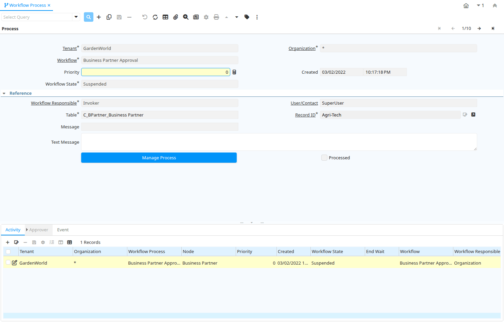

# Workflow Process

Window ID 297

*01/01/2004 → 09/02/2005*

**Description:** Monitor workflow processes

**Comment/Help:** View and Maintain Workflow Process Instance Information

## Tab: Process

*Tab Level 0 · Created 01/01/2004 · Updated 27/11/2005*

**Description:** Actual Workflow Process Instance

**Comment/Help:** Instance of a workflow execution

| **Name** | **Description** | **Comment/Help** | **Technical Data** |
|---|---|---|---|
| Tenant | Tenant for this installation. | A Tenant is a company or a legal entity. You cannot share data between Tenants. | AD_WF_Process.AD_Client_ID<small> numeric(10)   Table Direct</small> |
| Organization | Organizational entity within tenant | An organization is a unit of your tenant or legal entity - examples are store, department. You can share data between organizations. | AD_WF_Process.AD_Org_ID<small> numeric(10)   Table Direct</small> |
| Workflow | Workflow or combination of tasks | The Workflow field identifies a unique Workflow in the system. | AD_WF_Process.AD_Workflow_ID<small> numeric(10)   Table Direct</small> |
| Priority | Indicates if this request is of a high, medium or low priority. | The Priority indicates the importance of this request. | AD_WF_Process.Priority<small> numeric(10)   Integer</small> |
| Created | Date this record was created | The Created field indicates the date that this record was created. | AD_WF_Process.Created<small> timestamp without time zone   Date+Time</small> |
| Workflow State | State of the execution of the workflow |  | AD_WF_Process.WFState<small> character(2)   List</small> |
| Workflow Responsible | Responsible for Workflow Execution | The ultimate responsibility for a workflow is with an actual user. The Workflow Responsible allows to define ways to find that actual User. | AD_WF_Process.AD_WF_Responsible_ID<small> numeric(10)   Table Direct</small> |
| User/Contact | User within the system - Internal or Business Partner Contact | The User identifies a unique user in the system. This could be an internal user or a business partner contact | AD_WF_Process.AD_User_ID<small> numeric(10)   Search</small> |
| Table | Database Table information | The Database Table provides the information of the table definition | AD_WF_Process.AD_Table_ID<small> numeric(10)   Search</small> |
| Record ID | Direct internal record ID | The Record ID is the internal unique identifier of a record. Please note that zooming to the record may not be successful for Orders, Invoices and Shipment/Receipts as sometimes the Sales Order type is not known. | AD_WF_Process.Record_ID<small> numeric(10)   Record ID</small> |
| Message | System Message | Information and Error messages | AD_WF_Process.AD_Message_ID<small> numeric(10)   Search</small> |
| Text Message | Text Message |  | AD_WF_Process.TextMsg<small> character varying(2000)   Text</small> |
| Manage Process | Manage Workflow Process | Update or stop Workflow Process | AD_WF_Process.Processing<small> character(1)   Button</small> |
| Processed | The document has been processed | The Processed checkbox indicates that a document has been processed. | AD_WF_Process.Processed<small> character(1)   Yes-No</small> |

## Tab: › Activity

*Tab Level 1 · Created 01/01/2004 · Updated 02/01/2000*

**Description:** Workflow Activity

**Comment/Help:** The Workflow Activity is the actual Workflow Node in a Workflow Process instance

| **Name** | **Description** | **Comment/Help** | **Technical Data** |
|---|---|---|---|
| Tenant | Tenant for this installation. | A Tenant is a company or a legal entity. You cannot share data between Tenants. | AD_WF_Activity.AD_Client_ID<small> numeric(10)   Table Direct</small> |
| Organization | Organizational entity within tenant | An organization is a unit of your tenant or legal entity - examples are store, department. You can share data between organizations. | AD_WF_Activity.AD_Org_ID<small> numeric(10)   Table Direct</small> |
| Workflow Process | Actual Workflow Process Instance | Instance of a workflow execution | AD_WF_Activity.AD_WF_Process_ID<small> numeric(10)   Search</small> |
| Node | Workflow Node (activity), step or process | The Workflow Node indicates a unique step or process in a Workflow. | AD_WF_Activity.AD_WF_Node_ID<small> numeric(10)   Table Direct</small> |
| Priority | Indicates if this request is of a high, medium or low priority. | The Priority indicates the importance of this request. | AD_WF_Activity.Priority<small> numeric(10)   Integer</small> |
| Created | Date this record was created | The Created field indicates the date that this record was created. | AD_WF_Activity.Created<small> timestamp without time zone   Date+Time</small> |
| Workflow State | State of the execution of the workflow |  | AD_WF_Activity.WFState<small> character(2)   List</small> |
| End Wait | End of sleep time | End of suspension (sleep) | AD_WF_Activity.EndWaitTime<small> timestamp without time zone   Date+Time</small> |
| Workflow | Workflow or combination of tasks | The Workflow field identifies a unique Workflow in the system. | AD_WF_Activity.AD_Workflow_ID<small> numeric(10)   Table Direct</small> |
| Workflow Responsible | Responsible for Workflow Execution | The ultimate responsibility for a workflow is with an actual user. The Workflow Responsible allows to define ways to find that actual User. | AD_WF_Activity.AD_WF_Responsible_ID<small> numeric(10)   Table Direct</small> |
| User/Contact | User within the system - Internal or Business Partner Contact | The User identifies a unique user in the system. This could be an internal user or a business partner contact | AD_WF_Activity.AD_User_ID<small> numeric(10)   Search</small> |
| Table | Database Table information | The Database Table provides the information of the table definition | AD_WF_Activity.AD_Table_ID<small> numeric(10)   Search</small> |
| Record ID | Direct internal record ID | The Record ID is the internal unique identifier of a record. Please note that zooming to the record may not be successful for Orders, Invoices and Shipment/Receipts as sometimes the Sales Order type is not known. | AD_WF_Activity.Record_ID<small> numeric(10)   Record ID</small> |
| Message | System Message | Information and Error messages | AD_WF_Activity.AD_Message_ID<small> numeric(10)   Search</small> |
| Last Alert | Date when last alert were sent | The last alert date is updated when a reminder email is sent | AD_WF_Activity.DateLastAlert<small> timestamp without time zone   Date</small> |
| Text Message | Text Message |  | AD_WF_Activity.TextMsg<small> character varying(2000)   Text</small> |
| Manage Activity | Manage Workflow Activity | Update or stop Workflow Activity | AD_WF_Activity.Processing<small> character(1)   Button</small> |
| Processed | The document has been processed | The Processed checkbox indicates that a document has been processed. | AD_WF_Activity.Processed<small> character(1)   Yes-No</small> |
| Workflow Activity | Workflow Activity | The Workflow Activity is the actual Workflow Node in a Workflow Process instance | AD_WF_Activity.AD_WF_Activity_ID<small> numeric(10)   ID</small> |

## Tab: › › Approver

*Tab Level 2 · Created 10/08/2017 · Updated 10/08/2017*

| **Name** | **Description** | **Comment/Help** | **Technical Data** |
|---|---|---|---|
| Tenant | Tenant for this installation. | A Tenant is a company or a legal entity. You cannot share data between Tenants. | AD_WF_ActivityApprover.AD_Client_ID<small> numeric(10)   Table Direct</small> |
| Organization | Organizational entity within tenant | An organization is a unit of your tenant or legal entity - examples are store, department. You can share data between organizations. | AD_WF_ActivityApprover.AD_Org_ID<small> numeric(10)   Table Direct</small> |
| Workflow Activity | Workflow Activity | The Workflow Activity is the actual Workflow Node in a Workflow Process instance | AD_WF_ActivityApprover.AD_WF_Activity_ID<small> numeric(10)   Search</small> |
| User/Contact | User within the system - Internal or Business Partner Contact | The User identifies a unique user in the system. This could be an internal user or a business partner contact | AD_WF_ActivityApprover.AD_User_ID<small> numeric(10)   Search</small> |
| Active | The record is active in the system | There are two methods of making records unavailable in the system: One is to delete the record, the other is to de-activate the record. A de-activated record is not available for selection, but available for reports. There are two reasons for de-activating and not deleting records: (1) The system requires the record for audit purposes. (2) The record is referenced by other records. E.g., you cannot delete a Business Partner, if there are invoices for this partner record existing. You de-activate the Business Partner and prevent that this record is used for future entries. | AD_WF_ActivityApprover.IsActive<small> character(1)   Yes-No</small> |

## Tab: › Event

*Tab Level 1 · Created 02/01/2004 · Updated 10/08/2017*

**Description:** Workflow Process Activity Event Audit Information

**Comment/Help:** History of chenges ov the Workflow Process Activity

| **Name** | **Description** | **Comment/Help** | **Technical Data** |
|---|---|---|---|
| Tenant | Tenant for this installation. | A Tenant is a company or a legal entity. You cannot share data between Tenants. | AD_WF_EventAudit.AD_Client_ID<small> numeric(10)   Table Direct</small> |
| Organization | Organizational entity within tenant | An organization is a unit of your tenant or legal entity - examples are store, department. You can share data between organizations. | AD_WF_EventAudit.AD_Org_ID<small> numeric(10)   Table Direct</small> |
| Workflow Process | Actual Workflow Process Instance | Instance of a workflow execution | AD_WF_EventAudit.AD_WF_Process_ID<small> numeric(10)   Search</small> |
| Node | Workflow Node (activity), step or process | The Workflow Node indicates a unique step or process in a Workflow. | AD_WF_EventAudit.AD_WF_Node_ID<small> numeric(10)   Table Direct</small> |
| Workflow State | State of the execution of the workflow |  | AD_WF_EventAudit.WFState<small> character(2)   List</small> |
| Workflow Responsible | Responsible for Workflow Execution | The ultimate responsibility for a workflow is with an actual user. The Workflow Responsible allows to define ways to find that actual User. | AD_WF_EventAudit.AD_WF_Responsible_ID<small> numeric(10)   Table Direct</small> |
| User/Contact | User within the system - Internal or Business Partner Contact | The User identifies a unique user in the system. This could be an internal user or a business partner contact | AD_WF_EventAudit.AD_User_ID<small> numeric(10)   Search</small> |
| Table | Database Table information | The Database Table provides the information of the table definition | AD_WF_EventAudit.AD_Table_ID<small> numeric(10)   Table Direct</small> |
| Record ID | Direct internal record ID | The Record ID is the internal unique identifier of a record. Please note that zooming to the record may not be successful for Orders, Invoices and Shipment/Receipts as sometimes the Sales Order type is not known. | AD_WF_EventAudit.Record_ID<small> numeric(10)   Record ID</small> |
| Event Type | Type of Event |  | AD_WF_EventAudit.EventType<small> character(2)   List</small> |
| Attribute Name | Name of the Attribute | Identifier of the attribute | AD_WF_EventAudit.AttributeName<small> character varying(60)   String</small> |
| New Value | New field value | New data entered in the field | AD_WF_EventAudit.NewValue<small> character varying(2000)   String</small> |
| Old Value | The old file data | Old data overwritten in the field | AD_WF_EventAudit.OldValue<small> character varying(2000)   String</small> |
| Description | Optional short description of the record | A description is limited to 255 characters. | AD_WF_EventAudit.Description<small> character varying(255)   String</small> |
| Text Message | Text Message |  | AD_WF_EventAudit.TextMsg<small> character varying(2000)   Text</small> |
| Elapsed Time ms | Elapsed Time in milli seconds | Elapsed Time in milli seconds | AD_WF_EventAudit.ElapsedTimeMS<small> numeric   Number</small> |
| Created | Date this record was created | The Created field indicates the date that this record was created. | AD_WF_EventAudit.Created<small> timestamp without time zone   Date+Time</small> |
| Workflow Event Audit | Workflow Process Activity Event Audit Information | History of changes of the Workflow Process Activity | AD_WF_EventAudit.AD_WF_EventAudit_ID<small> numeric(10)   ID</small> |

