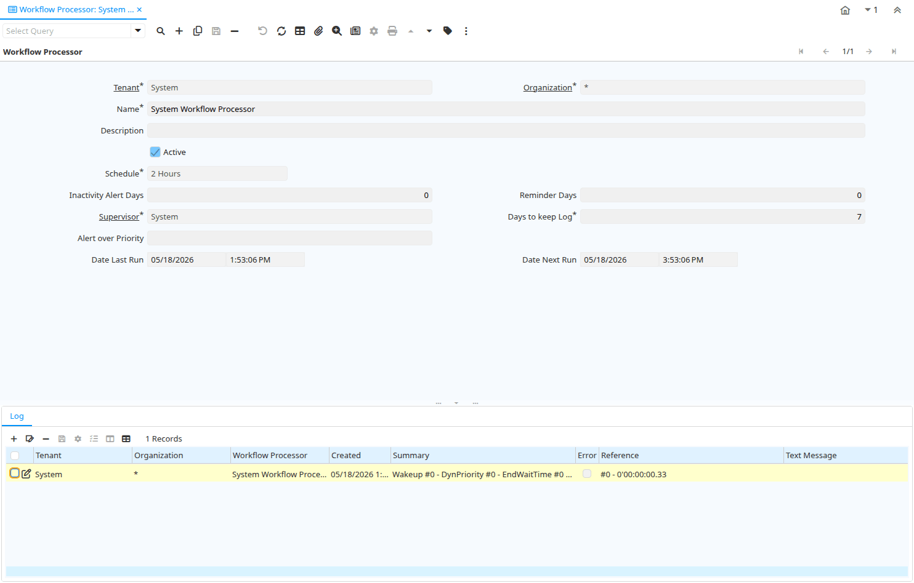

# Workflow Processor

Window ID 306

*19/02/2004 → 02/01/2000*

**Description:** Maintain Workflow Processor and Logs

**Comment/Help:** Workflow Processor Server Parameters

## Tab: Workflow Processor

*Tab Level 0 · Created 19/02/2004 · Updated 02/01/2000*

**Description:** Workflow Processor Server

**Comment/Help:** Workflow Processor Server

| **Name** | **Description** | **Comment/Help** | **Technical Data** |
|---|---|---|---|
| Tenant | Tenant for this installation. | A Tenant is a company or a legal entity. You cannot share data between Tenants. | AD_WorkflowProcessor.AD_Client_ID<small> numeric(10)   Table Direct</small> |
| Organization | Organizational entity within tenant | An organization is a unit of your tenant or legal entity - examples are store, department. You can share data between organizations. | AD_WorkflowProcessor.AD_Org_ID<small> numeric(10)   Table Direct</small> |
| Name | Alphanumeric identifier of the entity | The name of an entity (record) is used as an default search option in addition to the search key. The name is up to 60 characters in length. | AD_WorkflowProcessor.Name<small> character varying(60)   String</small> |
| Description | Optional short description of the record | A description is limited to 255 characters. | AD_WorkflowProcessor.Description<small> character varying(255)   String</small> |
| Active | The record is active in the system | There are two methods of making records unavailable in the system: One is to delete the record, the other is to de-activate the record. A de-activated record is not available for selection, but available for reports. There are two reasons for de-activating and not deleting records: (1) The system requires the record for audit purposes. (2) The record is referenced by other records. E.g., you cannot delete a Business Partner, if there are invoices for this partner record existing. You de-activate the Business Partner and prevent that this record is used for future entries. | AD_WorkflowProcessor.IsActive<small> character(1)   Yes-No</small> |
| Schedule |  |  | AD_WorkflowProcessor.AD_Schedule_ID<small> numeric(10)   Table Direct</small> |
| Inactivity Alert Days | Send Alert when there is no activity after days (0= no alert) | An email alert is sent when the request shows no activity for the number of days defined. | AD_WorkflowProcessor.InactivityAlertDays<small> numeric(10)   Integer</small> |
| Reminder Days | Days between sending Reminder Emails for a due or inactive Document | When a document is due for too long without activity, a reminder is sent. 0 means no reminders. The Remind Days are the days when the next email reminder is sent. | AD_WorkflowProcessor.RemindDays<small> numeric(10)   Integer</small> |
| Supervisor | Supervisor for this user/organization - used for escalation and approval | The Supervisor indicates who will be used for forwarding and escalating issues for this user - or for approvals. | AD_WorkflowProcessor.Supervisor_ID<small> numeric(10)   Table</small> |
| Days to keep Log | Number of days to keep the log entries | Older Log entries may be deleted | AD_WorkflowProcessor.KeepLogDays<small> numeric(10)   Integer</small> |
| Alert over Priority | Send alert email when over priority | Send alert email when a suspended activity is over the  priority defined | AD_WorkflowProcessor.AlertOverPriority<small> numeric(10)   Integer</small> |
| Date Last Run | Date the process was last run. | The Date Last Run indicates the last time that a process was run. | AD_WorkflowProcessor.DateLastRun<small> timestamp without time zone   Date+Time</small> |
| Date Next Run | Date the process will run next | The Date Next Run indicates the next time this process will run. | AD_WorkflowProcessor.DateNextRun<small> timestamp without time zone   Date+Time</small> |

## Tab: › Log

*Tab Level 1 · Created 19/02/2004 · Updated 02/01/2000*

**Description:** Workflow Processor Log

**Comment/Help:** Result of the execution of the Workflow Processor

| **Name** | **Description** | **Comment/Help** | **Technical Data** |
|---|---|---|---|
| Tenant | Tenant for this installation. | A Tenant is a company or a legal entity. You cannot share data between Tenants. | AD_WorkflowProcessorLog.AD_Client_ID<small> numeric(10)   Table Direct</small> |
| Organization | Organizational entity within tenant | An organization is a unit of your tenant or legal entity - examples are store, department. You can share data between organizations. | AD_WorkflowProcessorLog.AD_Org_ID<small> numeric(10)   Table Direct</small> |
| Workflow Processor | Workflow Processor Server | Workflow Processor Server | AD_WorkflowProcessorLog.AD_WorkflowProcessor_ID<small> numeric(10)   Table Direct</small> |
| Created | Date this record was created | The Created field indicates the date that this record was created. | AD_WorkflowProcessorLog.Created<small> timestamp without time zone   Date+Time</small> |
| Summary | Textual summary of this request | The Summary allows free form text entry of a recap of this request. | AD_WorkflowProcessorLog.Summary<small> character varying(2000)   Text</small> |
| Error | An Error occurred in the execution |  | AD_WorkflowProcessorLog.IsError<small> character(1)   Yes-No</small> |
| Reference | Reference for this record | The Reference displays the source document number. | AD_WorkflowProcessorLog.Reference<small> character varying(60)   String</small> |
| Text Message | Text Message |  | AD_WorkflowProcessorLog.TextMsg<small> character varying(2000)   Text</small> |
| Description | Optional short description of the record | A description is limited to 255 characters. | AD_WorkflowProcessorLog.Description<small> character varying(255)   String</small> |

