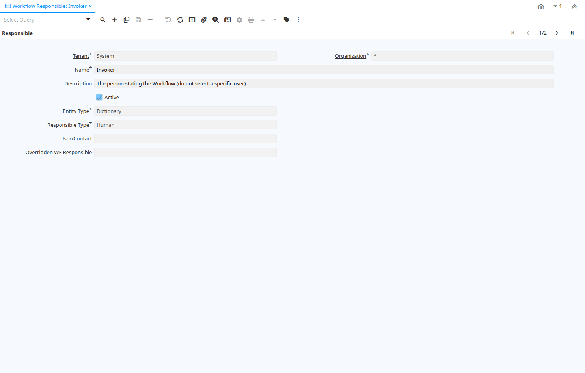

# Workflow Responsible

Window ID 299

*01/01/2004 → 02/01/2000*

**Description:** Responsible for Workflow Execution

**Comment/Help:** The ultimate responsibility for a workflow is with an actual user. The Workflow Responsible allows to define ways to find that actual User.

## Tab: Responsible

*Tab Level 0 · Created 01/01/2004 · Updated 02/01/2000*

**Description:** Responsible for Workflow Execution

**Comment/Help:** The ultimate responsibility for a workflow is with an actual user. The Workflow Responsible allows to define ways to find that actual User.

| **Name** | **Description** | **Comment/Help** | **Technical Data** |
|---|---|---|---|
| Tenant | Tenant for this installation. | A Tenant is a company or a legal entity. You cannot share data between Tenants. | AD_WF_Responsible.AD_Client_ID<small> numeric(10)   Table Direct</small> |
| Organization | Organizational entity within tenant | An organization is a unit of your tenant or legal entity - examples are store, department. You can share data between organizations. | AD_WF_Responsible.AD_Org_ID<small> numeric(10)   Table Direct</small> |
| Name | Alphanumeric identifier of the entity | The name of an entity (record) is used as an default search option in addition to the search key. The name is up to 60 characters in length. | AD_WF_Responsible.Name<small> character varying(60)   String</small> |
| Description | Optional short description of the record | A description is limited to 255 characters. | AD_WF_Responsible.Description<small> character varying(255)   String</small> |
| Active | The record is active in the system | There are two methods of making records unavailable in the system: One is to delete the record, the other is to de-activate the record. A de-activated record is not available for selection, but available for reports. There are two reasons for de-activating and not deleting records: (1) The system requires the record for audit purposes. (2) The record is referenced by other records. E.g., you cannot delete a Business Partner, if there are invoices for this partner record existing. You de-activate the Business Partner and prevent that this record is used for future entries. | AD_WF_Responsible.IsActive<small> character(1)   Yes-No</small> |
| Entity Type | Dictionary Entity Type; Determines ownership and synchronization | The Entity Types "Dictionary", "iDempiere" and "Application" might be automatically synchronized and customizations deleted or overwritten.    For customizations, copy the entity and select "User"! | AD_WF_Responsible.EntityType<small> character varying(40)   Table</small> |
| Responsible Type | Type of the Responsibility for a workflow | Type how the responsible user for the execution of a workflow is determined | AD_WF_Responsible.ResponsibleType<small> character(1)   List</small> |
| Role | Responsibility Role | The Role determines security and access a user who has this Role will have in the System. | AD_WF_Responsible.AD_Role_ID<small> numeric(10)   Table Direct</small> |
| User/Contact | User within the system - Internal or Business Partner Contact | The User identifies a unique user in the system. This could be an internal user or a business partner contact | AD_WF_Responsible.AD_User_ID<small> numeric(10)   Search</small> |
| Overridden WF Responsible |  |  | AD_WF_Responsible.Override_ID<small> numeric(10)   Search</small> |

