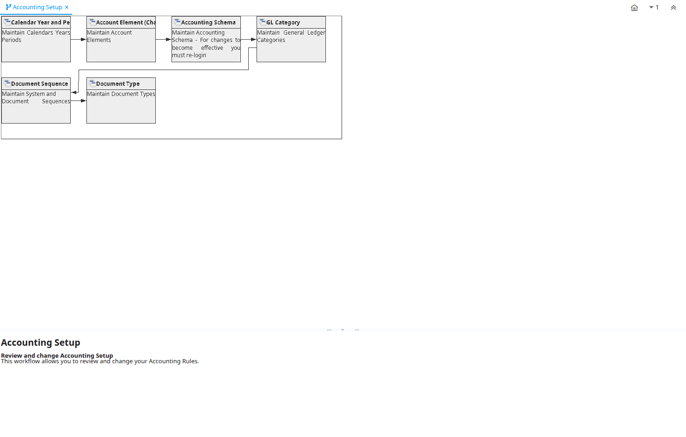

# Accounting Setup

Workflow ID 105

*05/04/2001 → 25/12/2005*

**Description:** Review and change Accounting Setup

**Comment/Help:** This workflow allows you to review and change your Accounting Rules. 

## Table: Fields

| **Name** | **Description** | **Comment/Help** | **Type** | **Zoom** |
|---|---|---|---|---|
| Calendar Year and Period | Maintain Calendars Years Periods | The Calendar Year and Periods defines the calendars that will be used for period control and reporting. You can also define non-standard calendars (e.g. business year from July to June). | User Window | Calendar Year and Period |
| Account Element (Chart of Accounts) | Maintain Account Elements | The Account Element Window is used to define and maintain the Accounting Element and User Defined Elements.  One of the account segments is your natural account segment (Chart of Account). You may add a new account element for parallel reporting or for user defined accounting segments. | User Window | Account Element (Chart of Accounts) |
| Accounting Schema | Maintain Accounting Schema - For changes to become effective you must re-login | The Accounting Schema Window defines an accounting method and the elements that will comprise an account structure. Create and activate elements for detailed accounting for Business Partners, Products, Locations, etc. Review and change the GL and Default accounts. The actual accounts used in transactions depend on the executing organization; Most of the information is derived from the context. | User Window | Accounting Schema |
| GL Category | Maintain General Ledger Categories | The GL Category Window allows you to define categories to be used in journals.  These categories provide a method of optionally grouping and reporting on journals. | User Window | GL Category |
| Document Sequence | Maintain System and Document Sequences | The Sequence Window defines how document numbers will be sequenced. Change the way document numbers are generated. You may add a prefix or a suffix or change the current number. | User Window | Document Sequence |
| Document Type | Maintain Document Types | The Document Type Window defines any document to be used in the system.  Each document type provides the basis for processing of each document and controls the printed name and document sequence used.   | User Window | Document Type |

