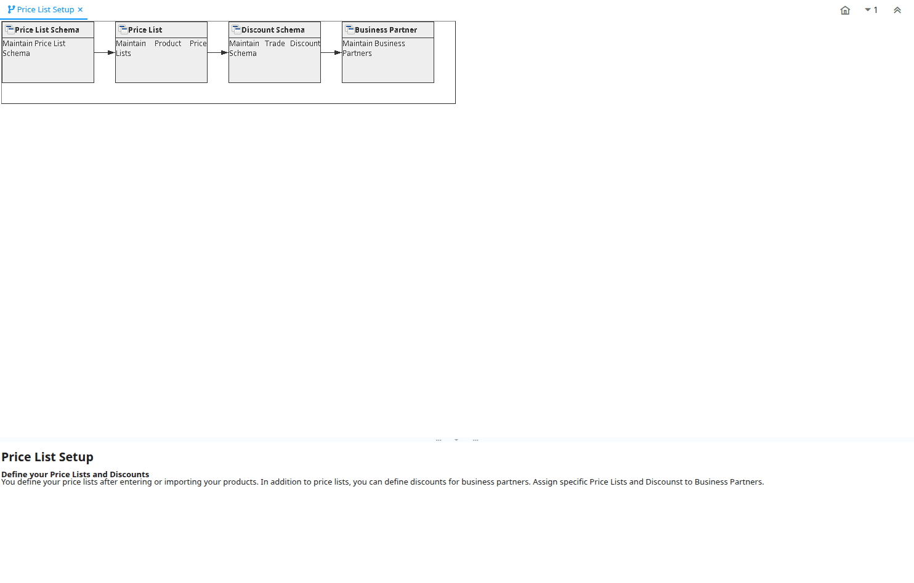

# Price List Setup

Workflow ID 108

*05/04/2001 → 25/12/2005*

**Description:** Define your Price Lists and Discounts

**Comment/Help:** You define your price lists after entering or importing your products. In addition to price lists, you can define discounts for business partners.  Assign specific Price Lists and Discounst to Business Partners.

## Table: Fields

| **Name** | **Description** | **Comment/Help** | **Type** | **Zoom** |
|---|---|---|---|---|
| Price List Schema | Maintain Price List Schema | Price List schema defines calculation rules for price lists | User Window | Price List Schema |
| Price List | Maintain Product Price Lists | The Price List Window allows you to generate product price lists for your Business Partners.  Price lists determine currency and tax treatment.  Price list versions allow to maintain parallel lists for different date ranges.  The most current pricelist version is used based on the document date. &lt;BR&gt; All pricelists have three prices: List, Standard and Limit &lt;BR&gt; First step is to create a base price list.  You can manually add products and enter the prices or create them automatically.  The base price list is often the purchase price list with list price ('official' retail price), the standard price (your purchase price).  The limit price can be used to check your final purchase costs after discounts, rebates, etc. &lt;BR&gt;  Pricelists can be calculated and copied.  To speed up the calculation, the parameters are stored an used when creating a new price list version. | User Window | Price List |
| Discount Schema | Maintain Trade Discount Schema | Trade discount schema calculates the trade discount percentage | User Window | Discount Schema |
| Business Partner | Maintain Business Partners | The Business Partner window allows you do define any party with whom you transact.  This includes customers, vendors and employees.  Prior to entering or importing products, you must define your vendors.  Prior to generating Orders you must define your customers.  This window holds all information about your business partner and the values entered will be used to generate all document transactions | User Window | Business Partner |

