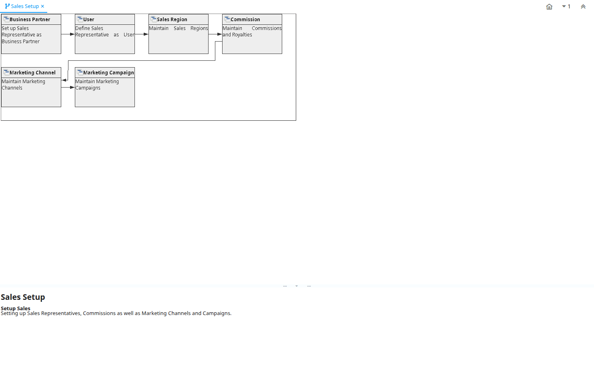

# Sales Setup

Workflow ID 111

*05/04/2001 → 25/12/2005*

**Description:** Setup Sales

**Comment/Help:** Setting up Sales Representatives, Commissions as well as Marketing Channels and Campaigns.

## Table: Fields

| **Name** | **Description** | **Comment/Help** | **Type** | **Zoom** |
|---|---|---|---|---|
| Business Partner | Set up Sales Representative as Business Partner | Set up the sales representative as Employee and Sales Representative in the Employee tab.  Also set up the Vendor part, if you want to create payments. | User Window | Business Partner |
| User | Define Sales Representative as User | Users can log into the system and have access to functionality via one or more roles. Select the Business Partner you just set up. This enables the user to be treated as sales rep in the system. | User Window | User |
| Sales Region | Maintain Sales Regions | The Sales Region Window defines the different regions where you do business.  You can generate reports based on Sales Regions | User Window | Sales Region |
| Commission | Maintain Commissions and Royalties | Define how and when you want the commissions to be calculated and to whom to pay it. The Commissions Window allows you define how commissions and royalties will be paid. You can pay multiple commissions for the same order or invoice (e.g. to the person entering the transaction, to the person responsible for sale of the product (category) and or business partner (group). | User Window | Commission |
| Marketing Channel | Maintain Marketing  Channels | The Marketing Channel Window defines the different channels used in Marketing Campaigns | User Window | Marketing Channel |
| Marketing Campaign | Maintain Marketing Campaigns | The Marketing Campaign Window defines the start and end date for a campaign.  It also gives a running balance of the invoice amounts which referred to this campaign. | User Window | Marketing Campaign |

