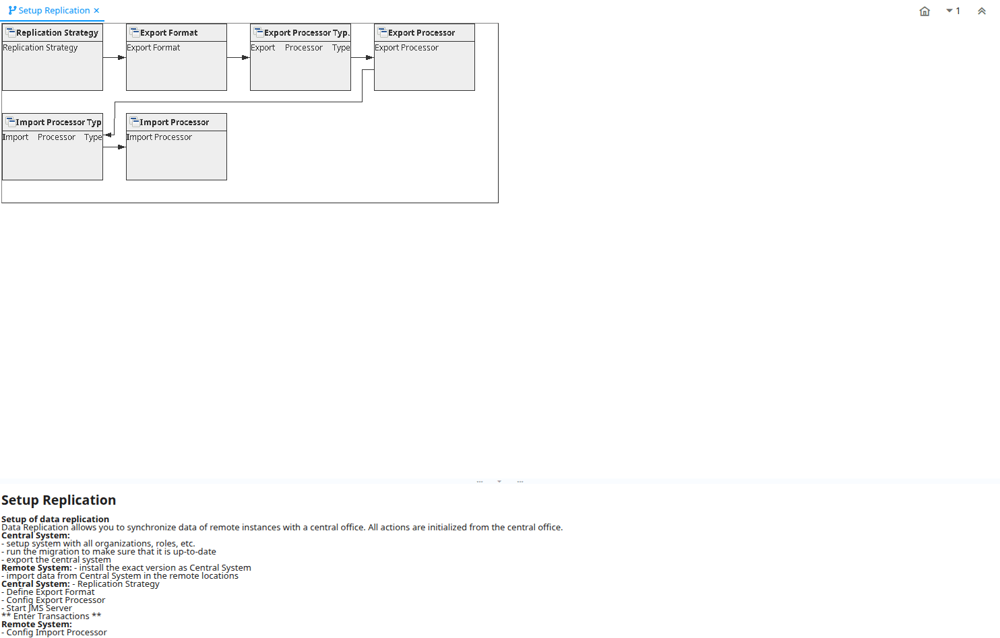

# Setup Replication

Workflow ID 50012

*05/03/2008 → 17/02/2022*

**Description:** Setup of data replication

**Comment/Help:** Data Replication allows you to synchronize data of remote instances with a central office.  All actions are initialized from the central office.&lt;p&gt;
&lt;b&gt;Central System:&lt;/b&gt;&lt;br&gt;
- setup system with all organizations, roles, etc.&lt;br&gt;
- run the migration to make sure that it is up-to-date&lt;br&gt;
- export the central system&lt;br&gt;
&lt;p&gt;
&lt;b&gt;Remote System:&lt;/b&gt;
- install the exact version as Central System&lt;br&gt;
- import data from Central System in the remote locations&lt;br&gt;
&lt;p&gt;
&lt;b&gt;Central System:&lt;/b&gt;
- Replication Strategy&lt;br&gt;
- Define Export Format&lt;br&gt;
- Config Export Processor&lt;br&gt;
- Start JMS Server&lt;br&gt;
&lt;p&gt;
** Enter Transactions **
&lt;p&gt;
&lt;b&gt;Remote System:&lt;/b&gt;&lt;br&gt;
- Config Import Processor&lt;br&gt;

## Table: Fields

| **Name** | **Description** | **Comment/Help** | **Type** | **Zoom** |
|---|---|---|---|---|
| Replication Strategy | Replication Strategy |  | User Window | Replication Strategy |
| Export Format | Export Format |  | User Window | Export Format |
| Export Processor Type | Export Processor Type |  | User Window | Export Processor Type |
| Export Processor | Export Processor |  | User Window | Export Processor |
| Import Processor Type | Import Processor Type |  | User Window | Import Processor Type |
| Import Processor | Import Processor |  | User Window | Import Processor |

