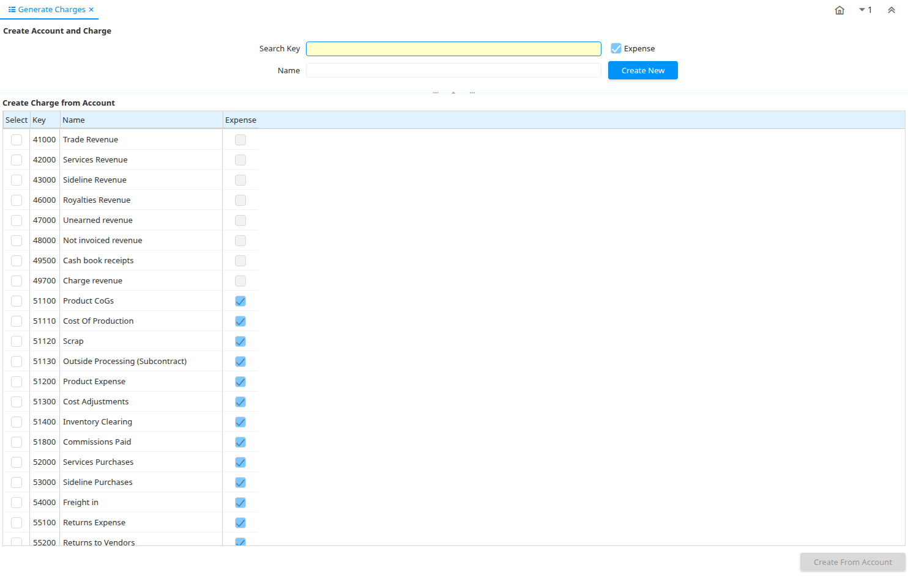

# Generate Charges

Special Form ID 105

*06/02/2001 → 02/01/2000*

**Description:** Generate Charges from natural accounts

**Comment/Help:** Use the upper portion to create new charges using the general charge accounts.  Use the lower portion to create charges based on the natural account.

**Classname:** `org.compiere.apps.form.VCharge`

