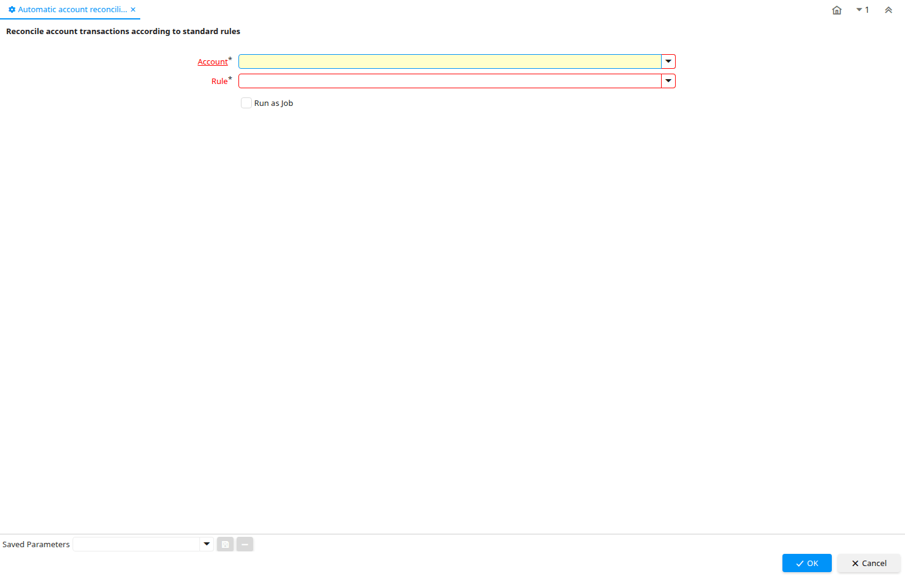

# Automatic account reconciliation

Process ID 53221

*02/09/2010 → 02/09/2010*

**Description:** Reconcile account transactions according to standard rules

**Classname:** `org.compiere.process.FactReconcile`

## Table: Process Parameters

| **Name** | **Description** | **Comment/Help** | **Technical Data** |
|---|---|---|---|
| Account | Account used | The (natural) account used | Account_ID Table |
| Rule |  |  | AD_Rule_ID Table |

