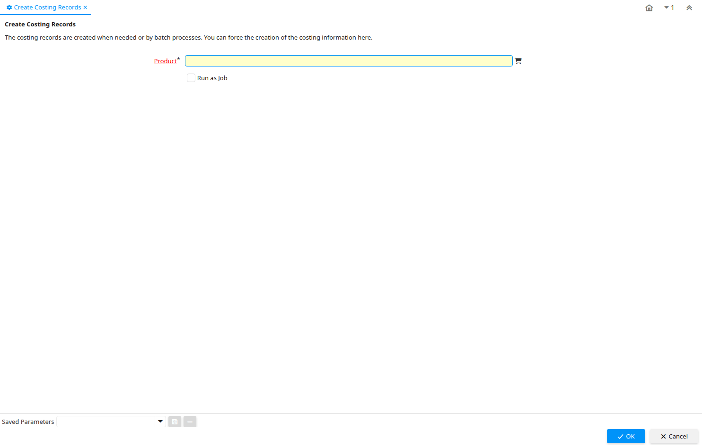

# Create Costing Records

Process ID 335

*19/09/2005 → 19/09/2005*

**Description:** Create Costing Records

**Comment/Help:** The costing records are created when needed or by batch processes. You can force the creation of the costing information here.

**Classname:** `org.compiere.process.CostCreate`

## Table: Process Parameters

| **Name** | **Description** | **Comment/Help** | **Technical Data** |
|---|---|---|---|
| Product | Product, Service, Item | Identifies an item which is either purchased or sold in this organization. | M_Product_ID Search |

