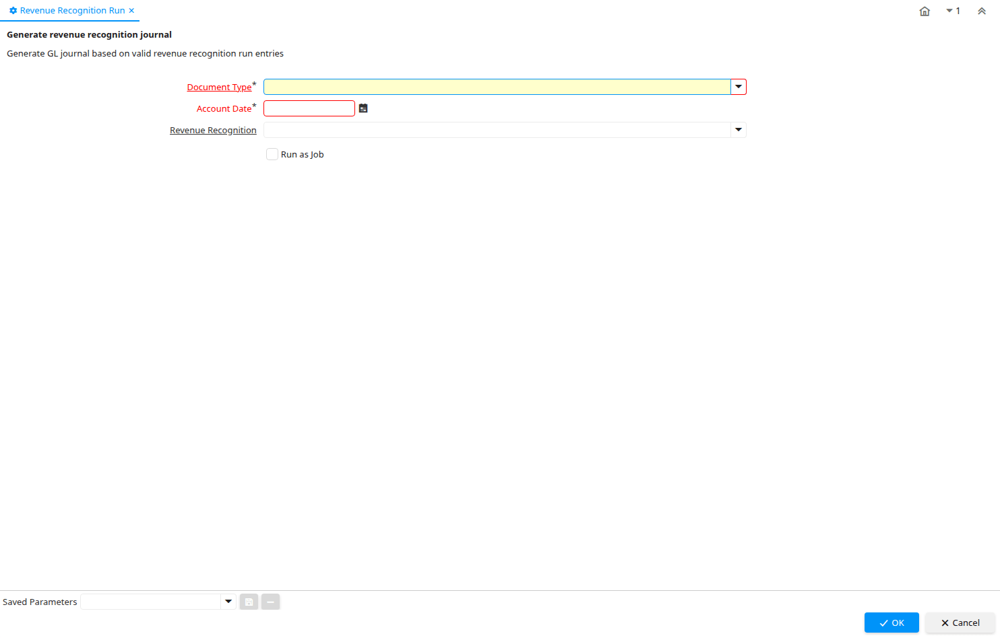

# Revenue Recognition Run

Process ID 53710

*28/10/2014 → 28/10/2014*

**Description:** Generate revenue recognition journal

**Comment/Help:** Generate GL journal based on valid revenue recognition run entries

**Classname:** `org.compiere.process.RevenueRecognition`

## Table: Process Parameters

| **Name** | **Description** | **Comment/Help** | **Technical Data** |
|---|---|---|---|
| Document Type | Document type or rules | The Document Type determines document sequence and processing rules | C_DocType_ID Table |
| Account Date | Accounting Date | The Accounting Date indicates the date to be used on the General Ledger account entries generated from this document. It is also used for any currency conversion. | DateAcct Date |
| Revenue Recognition | Method for recording revenue | The Revenue Recognition indicates how revenue will be recognized for this product | C_RevenueRecognition_ID Table Direct |

