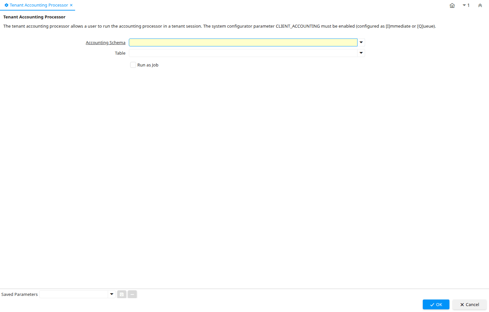

# Tenant Accounting Processor

Process ID 53187

*13/09/2009 → 10/03/2022*

**Description:** Tenant Accounting Processor

**Comment/Help:** The tenant accounting processor allows a user to run the accounting processor in a tenant session.  The system configurator parameter CLIENT_ACCOUNTING must be enabled (configured as [I]mmediate or [Q]ueue).

**Classname:** `org.adempiere.process.ClientAcctProcessor`

## Table: Process Parameters

| **Name** | **Description** | **Comment/Help** | **Technical Data** |
|---|---|---|---|
| Accounting Schema | Rules for accounting | An Accounting Schema defines the rules used in accounting such as costing method, currency and calendar | C_AcctSchema_ID Table Direct |
| Table | Database Table information | The Database Table provides the information of the table definition | AD_Table_ID Table Direct |

