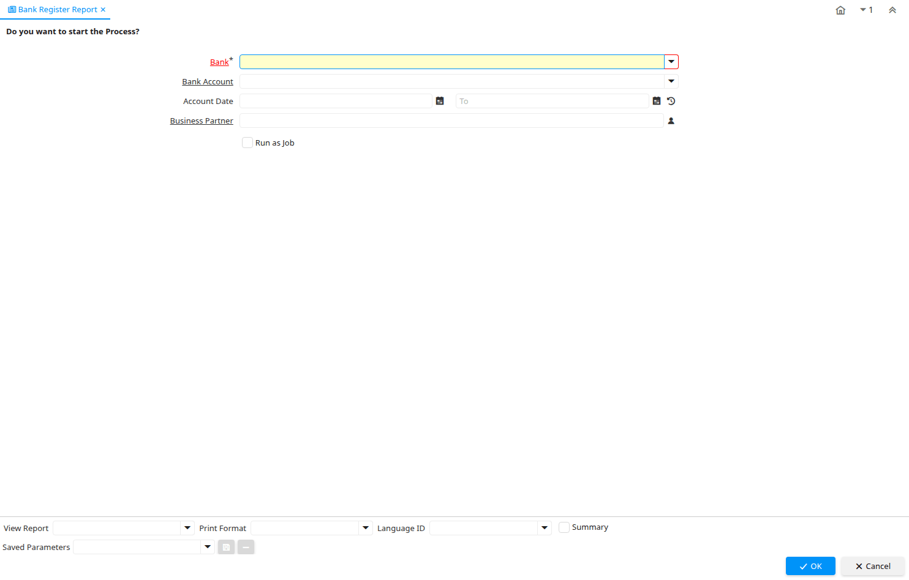

# Bank Register Report

Report ID 200035

*01/03/2013 → 01/03/2013*

**Classname:** `org.compiere.report.BankRegister`

## Table: Report Parameters

| **Name** | **Description** | **Comment/Help** | **Technical Data** |
|---|---|---|---|
| Bank | Bank | The Bank is a unique identifier of a Bank for this Organization or for a Business Partner with whom this Organization transacts. | C_Bank_ID Table Direct |
| Bank Account | Account at the Bank | The Bank Account identifies an account at this Bank. | C_BankAccount_ID Table Direct |
| Account Date | Accounting Date | The Accounting Date indicates the date to be used on the General Ledger account entries generated from this document. It is also used for any currency conversion. | DateAcct Date |
| Business Partner | Identifies a Business Partner | A Business Partner is anyone with whom you transact.  This can include Vendor, Customer, Employee or Salesperson | C_BPartner_ID Search |

