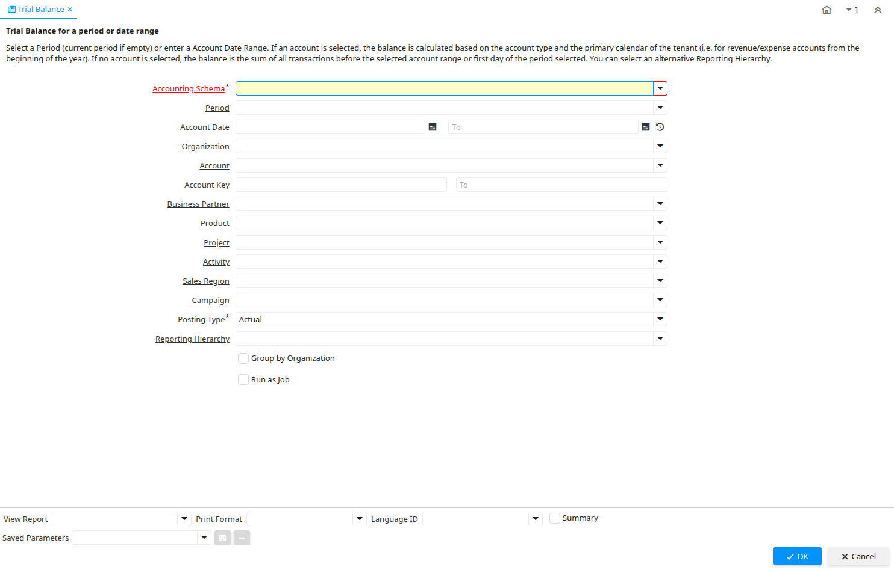

# Trial Balance

Report ID 310

*08/10/2004 → 10/03/2022*

**Description:** Trial Balance for a period or date range

**Comment/Help:** Select a Period (current period if empty) or enter a Account Date Range. If an account is selected, the balance is calculated based on the account type and the primary calendar of the tenant (i.e. for revenue/expense accounts from the beginning of the year). If no account is selected, the balance is the sum of all transactions before the selected account range or first day of the period selected. You can select an alternative Reporting Hierarchy.

**Classname:** `org.compiere.report.TrialBalance`

## Table: Report Parameters

| **Name** | **Description** | **Comment/Help** | **Technical Data** |
|---|---|---|---|
| Accounting Schema | Rules for accounting | An Accounting Schema defines the rules used in accounting such as costing method, currency and calendar | C_AcctSchema_ID Table Direct |
| Period | Period of the Calendar | The Period indicates an exclusive range of dates for a calendar. | C_Period_ID Table |
| Account Date | Accounting Date | The Accounting Date indicates the date to be used on the General Ledger account entries generated from this document. It is also used for any currency conversion. | DateAcct Date |
| Organization | Organizational entity within tenant | An organization is a unit of your tenant or legal entity - examples are store, department. You can share data between organizations. | AD_Org_ID Table Direct |
| Account | Account used | The (natural) account used | Account_ID Table |
| Account Key | Key of Account Element |  | AccountValue String |
| Business Partner | Identifies a Business Partner | A Business Partner is anyone with whom you transact.  This can include Vendor, Customer, Employee or Salesperson | C_BPartner_ID Table Direct |
| Product | Product, Service, Item | Identifies an item which is either purchased or sold in this organization. | M_Product_ID Table Direct |
| Project | Financial Project | A Project allows you to track and control internal or external activities. | C_Project_ID Table Direct |
| Activity | Business Activity | Activities indicate tasks that are performed and used to utilize Activity based Costing | C_Activity_ID Table Direct |
| Sales Region | Sales coverage region | The Sales Region indicates a specific area of sales coverage. | C_SalesRegion_ID Table Direct |
| Campaign | Marketing Campaign | The Campaign defines a unique marketing program.  Projects can be associated with a pre defined Marketing Campaign.  You can then report based on a specific Campaign. | C_Campaign_ID Table Direct |
| Posting Type | The type of posted amount for the transaction | The Posting Type indicates the type of amount (Actual, Budget, Reservation, Commitment, Statistical) the transaction. | PostingType List |
| Reporting Hierarchy | Optional Reporting Hierarchy - If not selected the default hierarchy trees are used. | Reporting Hierarchy allows you to select different Hierarchies/Trees for the report. Accounting Segments like Organization, Account, Product may have several hierarchies to accommodate different views on the business. | PA_Hierarchy_ID Table Direct |
| Group by Organization | Grouping based on Organization | An Organization wise grouping apply | IsGroupByOrg Yes-No |

