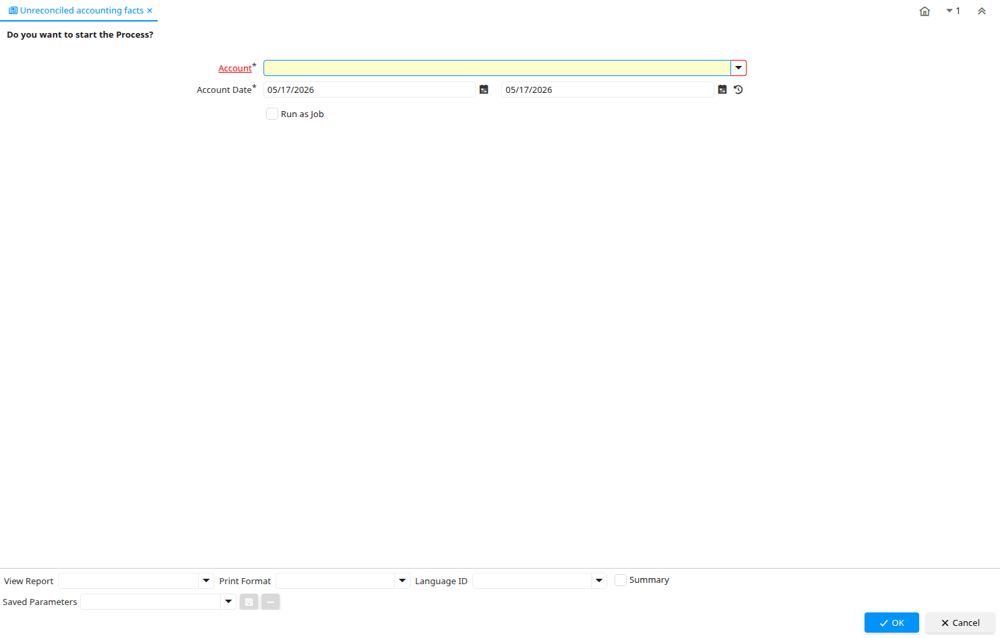

# Unreconciled accounting facts

Report ID 53220

*02/09/2010 → 02/09/2010*

**Classname:** `org.compiere.process.FactReconciliation`

## Table: Report Parameters

| **Name** | **Description** | **Comment/Help** | **Technical Data** |
|---|---|---|---|
| Account | Account used | The (natural) account used | Account_ID Table |
| Account Date | Accounting Date | The Accounting Date indicates the date to be used on the General Ledger account entries generated from this document. It is also used for any currency conversion. | DateAcct Date |

