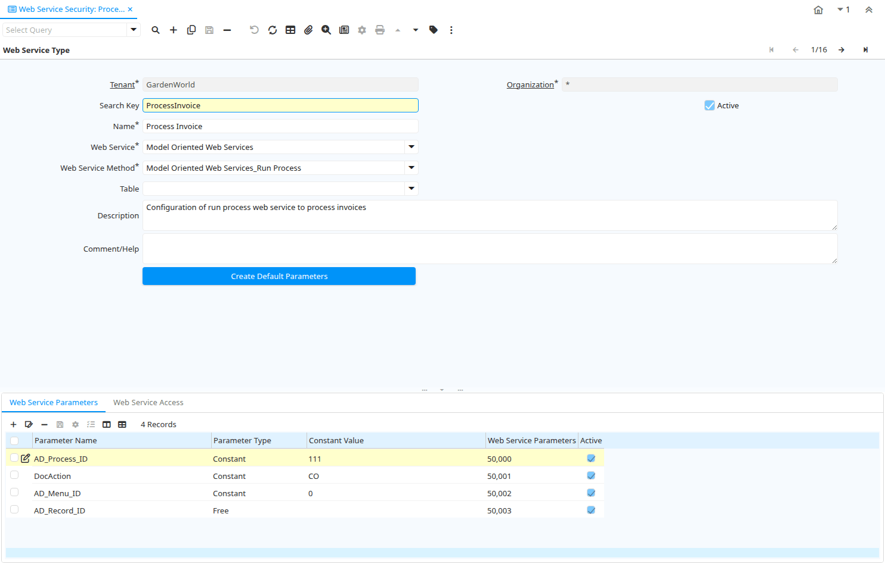

# Web Service Security

Window ID 53068

*30/01/2009 → 17/02/2022*

## Tab: Web Service Type

*Tab Level 0 · Created 30/01/2009 · Updated 27/08/2013*

| **Name** | **Description** | **Comment/Help** | **Technical Data** |
|---|---|---|---|
| Tenant | Tenant for this installation. | A Tenant is a company or a legal entity. You cannot share data between Tenants. | WS_WebServiceType.AD_Client_ID<small> numeric(10)   Table Direct</small> |
| Organization | Organizational entity within tenant | An organization is a unit of your tenant or legal entity - examples are store, department. You can share data between organizations. | WS_WebServiceType.AD_Org_ID<small> numeric(10)   Table Direct</small> |
| Search Key | Search key for the record in the format required - must be unique | A search key allows you a fast method of finding a particular record. If you leave the search key empty, the system automatically creates a numeric number.  The document sequence used for this fallback number is defined in the "Maintain Sequence" window with the name "DocumentNo_&lt;TableName&gt;", where TableName is the actual name of the table (e.g. C_Order). | WS_WebServiceType.Value<small> character varying(40)   String</small> |
| Active | The record is active in the system | There are two methods of making records unavailable in the system: One is to delete the record, the other is to de-activate the record. A de-activated record is not available for selection, but available for reports. There are two reasons for de-activating and not deleting records: (1) The system requires the record for audit purposes. (2) The record is referenced by other records. E.g., you cannot delete a Business Partner, if there are invoices for this partner record existing. You de-activate the Business Partner and prevent that this record is used for future entries. | WS_WebServiceType.IsActive<small> character(1)   Yes-No</small> |
| Name | Alphanumeric identifier of the entity | The name of an entity (record) is used as an default search option in addition to the search key. The name is up to 60 characters in length. | WS_WebServiceType.Name<small> character varying(60)   String</small> |
| Web Service |  |  | WS_WebServiceType.WS_WebService_ID<small> numeric(10)   Table Direct</small> |
| Web Service Method |  |  | WS_WebServiceType.WS_WebServiceMethod_ID<small> numeric(10)   Table Direct</small> |
| Table | Database Table information | The Database Table provides the information of the table definition | WS_WebServiceType.AD_Table_ID<small> numeric(10)   Table Direct</small> |
| Description | Optional short description of the record | A description is limited to 255 characters. | WS_WebServiceType.Description<small> character varying(255)   String</small> |
| Comment/Help | Comment or Hint | The Help field contains a hint, comment or help about the use of this item. | WS_WebServiceType.Help<small> character varying(2000)   Text</small> |
| Create Default Parameters | This process will add required parameters for current web service type |  | WS_WebServiceType.InsertParameters<small> character(1)   Button</small> |

## Tab: › Web Service Parameters

*Tab Level 1 · Created 30/01/2009 · Updated 18/06/2020*

| **Name** | **Description** | **Comment/Help** | **Technical Data** |
|---|---|---|---|
| Tenant | Tenant for this installation. | A Tenant is a company or a legal entity. You cannot share data between Tenants. | WS_WebService_Para.AD_Client_ID<small> numeric(10)   Table Direct</small> |
| Organization | Organizational entity within tenant | An organization is a unit of your tenant or legal entity - examples are store, department. You can share data between organizations. | WS_WebService_Para.AD_Org_ID<small> numeric(10)   Table Direct</small> |
| Web Service Type |  |  | WS_WebService_Para.WS_WebServiceType_ID<small> numeric(10)   Table Direct</small> |
| Parameter Name |  |  | WS_WebService_Para.ParameterName<small> character varying(60)   String</small> |
| Parameter Type |  |  | WS_WebService_Para.ParameterType<small> character(1)   List</small> |
| Constant Value | Constant value |  | WS_WebService_Para.ConstantValue<small> character varying(2000)   String</small> |
| Active | The record is active in the system | There are two methods of making records unavailable in the system: One is to delete the record, the other is to de-activate the record. A de-activated record is not available for selection, but available for reports. There are two reasons for de-activating and not deleting records: (1) The system requires the record for audit purposes. (2) The record is referenced by other records. E.g., you cannot delete a Business Partner, if there are invoices for this partner record existing. You de-activate the Business Partner and prevent that this record is used for future entries. | WS_WebService_Para.IsActive<small> character(1)   Yes-No</small> |

## Tab: › Web Service Field Input

*Tab Level 1 · Created 30/01/2009 · Updated 18/06/2020*

| **Name** | **Description** | **Comment/Help** | **Technical Data** |
|---|---|---|---|
| Tenant | Tenant for this installation. | A Tenant is a company or a legal entity. You cannot share data between Tenants. | WS_WebServiceFieldInput.AD_Client_ID<small> numeric(10)   Table Direct</small> |
| Organization | Organizational entity within tenant | An organization is a unit of your tenant or legal entity - examples are store, department. You can share data between organizations. | WS_WebServiceFieldInput.AD_Org_ID<small> numeric(10)   Table Direct</small> |
| Web Service Type |  |  | WS_WebServiceFieldInput.WS_WebServiceType_ID<small> numeric(10)   Table Direct</small> |
| Column | Column in the table | Link to the database column of the table | WS_WebServiceFieldInput.AD_Column_ID<small> numeric(10)   Table Direct</small> |
| DB Column Name | Name of the column in the database | The Column Name indicates the name of a column on a table as defined in the database. | WS_WebServiceFieldInput.ColumnName<small> character varying(63)   String</small> |
| Reference | System Reference and Validation | The Reference could be a display type, list or table validation. | WS_WebServiceFieldInput.AD_Reference_ID<small> numeric(10)   Table</small> |
| Reference Key | Required to specify, if data type is Table or List | The Reference Value indicates where the reference values are stored.  It must be specified if the data type is Table or List.   | WS_WebServiceFieldInput.AD_Reference_Value_ID<small> numeric(10)   Table</small> |
| Active | The record is active in the system | There are two methods of making records unavailable in the system: One is to delete the record, the other is to de-activate the record. A de-activated record is not available for selection, but available for reports. There are two reasons for de-activating and not deleting records: (1) The system requires the record for audit purposes. (2) The record is referenced by other records. E.g., you cannot delete a Business Partner, if there are invoices for this partner record existing. You de-activate the Business Partner and prevent that this record is used for future entries. | WS_WebServiceFieldInput.IsActive<small> character(1)   Yes-No</small> |
| Identifier | This column is part of the record identifier | The Identifier checkbox indicates that this column is part of the identifier or key for this table.   | WS_WebServiceFieldInput.IsIdentifier<small> character(1)   Yes-No</small> |
| Allow Null Value | Should allow null value for identifier field |  | WS_WebServiceFieldInput.IsNullIdentifier<small> character(1)   Yes-No</small> |
| Identifier Logic |  |  | WS_WebServiceFieldInput.IdentifierLogic<small> character varying(2000)   Text</small> |

## Tab: › Web Service Field Output

*Tab Level 1 · Created 30/01/2009 · Updated 18/06/2020*

| **Name** | **Description** | **Comment/Help** | **Technical Data** |
|---|---|---|---|
| Tenant | Tenant for this installation. | A Tenant is a company or a legal entity. You cannot share data between Tenants. | WS_WebServiceFieldOutput.AD_Client_ID<small> numeric(10)   Table Direct</small> |
| Organization | Organizational entity within tenant | An organization is a unit of your tenant or legal entity - examples are store, department. You can share data between organizations. | WS_WebServiceFieldOutput.AD_Org_ID<small> numeric(10)   Table Direct</small> |
| Web Service Type |  |  | WS_WebServiceFieldOutput.WS_WebServiceType_ID<small> numeric(10)   Table Direct</small> |
| Column | Column in the table | Link to the database column of the table | WS_WebServiceFieldOutput.AD_Column_ID<small> numeric(10)   Table Direct</small> |
| Active | The record is active in the system | There are two methods of making records unavailable in the system: One is to delete the record, the other is to de-activate the record. A de-activated record is not available for selection, but available for reports. There are two reasons for de-activating and not deleting records: (1) The system requires the record for audit purposes. (2) The record is referenced by other records. E.g., you cannot delete a Business Partner, if there are invoices for this partner record existing. You de-activate the Business Partner and prevent that this record is used for future entries. | WS_WebServiceFieldOutput.IsActive<small> character(1)   Yes-No</small> |

## Tab: › Web Service Access

*Tab Level 1 · Created 30/01/2009 · Updated 18/06/2020*

| **Name** | **Description** | **Comment/Help** | **Technical Data** |
|---|---|---|---|
| Tenant | Tenant for this installation. | A Tenant is a company or a legal entity. You cannot share data between Tenants. | WS_WebServiceTypeAccess.AD_Client_ID<small> numeric(10)   Table Direct</small> |
| Organization | Organizational entity within tenant | An organization is a unit of your tenant or legal entity - examples are store, department. You can share data between organizations. | WS_WebServiceTypeAccess.AD_Org_ID<small> numeric(10)   Table Direct</small> |
| Web Service Type |  |  | WS_WebServiceTypeAccess.WS_WebServiceType_ID<small> numeric(10)   Table Direct</small> |
| Role | Responsibility Role | The Role determines security and access a user who has this Role will have in the System. | WS_WebServiceTypeAccess.AD_Role_ID<small> numeric(10)   Table</small> |
| Active | The record is active in the system | There are two methods of making records unavailable in the system: One is to delete the record, the other is to de-activate the record. A de-activated record is not available for selection, but available for reports. There are two reasons for de-activating and not deleting records: (1) The system requires the record for audit purposes. (2) The record is referenced by other records. E.g., you cannot delete a Business Partner, if there are invoices for this partner record existing. You de-activate the Business Partner and prevent that this record is used for future entries. | WS_WebServiceTypeAccess.IsActive<small> character(1)   Yes-No</small> |

